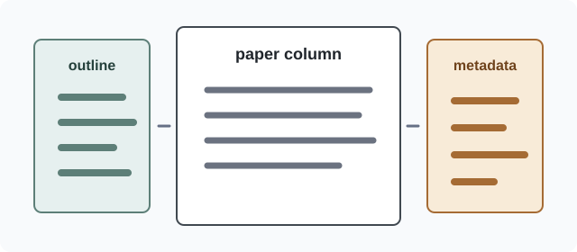

# Scholarly Three-Column Fixture

**Summary:** This sample verifies that a Markdown research note can become a
self-contained scholarly HTML document with a persistent outline, a restrained
paper column, and a metadata rail for provenance and caveats.

## 1. Motivation

The fixture keeps navigational structure outside the article flow so the paper
body remains focused on the argument. The source still reads like ordinary
Markdown, while the rendered shell supplies the three-column layout.



*Figure 1: Local SVG asset used to verify offline image embedding.*

## 2. Scoring Model

For a compact smoke test, the rendered output represents the weighted score as
offline MathML:

$$
S = \frac{\sum_{i=1}^{n} w_i x_i}{\sum_{i=1}^{n} w_i}
$$

The variables are intentionally simple: `x_i` is an observed layout signal and
`w_i` is its configured weight.

## 3. Fixture Matrix

| Feature | Expected rendering |
| --- | --- |
| Local figure | Embedded `data:image/svg+xml` URI |
| Formula | MathML, no remote script dependency |
| Outline | Left rail on desktop, collapsible block on mobile |
| Metadata | Right rail with source and caveat summaries |

```python
def weighted_score(values: list[float], weights: list[float]) -> float:
    """Return a normalized weighted score for fixture examples."""
    return sum(value * weight for value, weight in zip(values, weights)) / sum(weights)
```

## 4. Caveats

- The expected HTML is hand-authored so DOM regressions are easy to inspect.
- The source Markdown is a fixture, not a benchmark for typographic quality.
- Visual browser checks remain separate from this structural example.

## References

1. Render HTML skill fixture contract, local workspace example.
2. Metadata sidecar in `metadata.yaml`.
3. Local SVG figure in `assets/layout-study.svg`.
