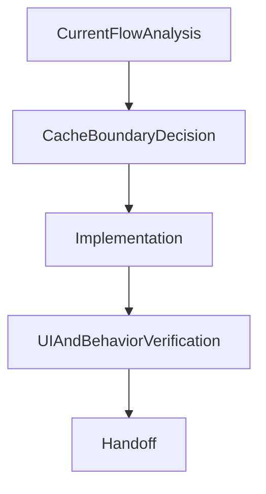
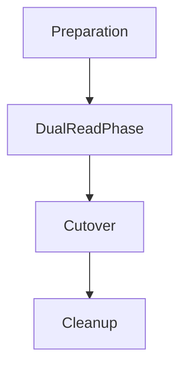
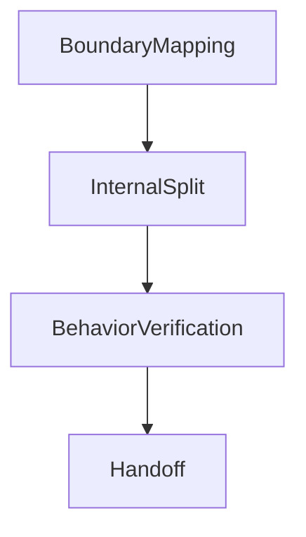
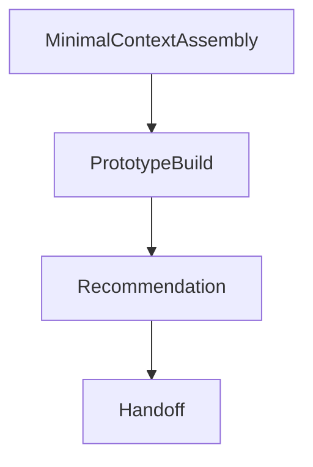

# Write Executable Plan Examples

Use these examples as patterns, not rigid boilerplate.

## How to Read These Examples

These examples are **not** universal best practices for every case.

They exist to show what a strong executable-plan pattern looks like under a particular task shape. When adapting them:

- preserve the contract-quality signals
- adapt the domain details to the actual work
- avoid copying the surface form blindly

When reading a positive example, ask:

- What makes this example executable in general?
- Which parts define quality boundaries?
- Which parts are case-specific and should be replaced?

When reading a negative example, ask:

- Which contract obligations are missing?
- Why would a downstream agent struggle with this shape?
- What is the smallest change that restores executability?

## Example 1 — `delivery`

Save as: `plan.delivery.search-suggestions-cache.md`

````markdown
# Add Cached Search Suggestions

**Goal:** Add search suggestions with a short-lived cache so users see faster results while typing.
**Task Type:** `search-suggestions-cache`
**Contract Profile:** `delivery`
**Mode:** `credit-rich`
**Primary Success Signal:** Typing in the search box shows relevant suggestions, and repeated queries avoid redundant backend work.

## Inputs / Context Sources
- `src/search/SearchBox.tsx`
- `src/search/searchApi.ts`
- `src/server/search/suggestions.ts`
- `src/search/__tests__/SearchBox.test.tsx`
- Product note: suggestions should remain fresh within a short typing session

## Context Scope
- Use only the listed files and product note as required local context.
- Do not assume broader repository exploration unless these files expose a real gap.

## Flow Graph



### Transition Definitions

```yaml
transitions:
  - from: cache-boundary-decision
    to: implementation
    checkpoint:
      id: cache-boundary-review
      mode: auto_review
      review_focus:
        - cache placement
        - invalidation scope
      continue_if:
        - cache ownership is clear
        - invalidation scope is understood
        - no cross-feature freshness risk is unresolved
      on_fail:
        - revise_plan
        - or_stop_for_clarification
```

## Stages
### Stage 1: Analyze the current suggestion path
**Purpose:** Determine where suggestions are requested today and where cache ownership should live.
**Files:** `src/search/SearchBox.tsx`, `src/search/searchApi.ts`, `src/server/search/suggestions.ts`
**Exit Signal:** The cache boundary is clear enough to implement without guesswork.
**Checklist:**
[ ] Read the current suggestion request path from UI to backend
[ ] Identify where duplicate work currently happens
[ ] Choose the cache boundary
[ ] Stop and revise if cache ownership remains ambiguous

### Stage 2: Implement cache-aware behavior
**Purpose:** Introduce caching at the chosen boundary without changing visible behavior.
**Files:** `src/search/searchApi.ts`, `src/server/search/suggestions.ts`, `src/search/__tests__/SearchBox.test.tsx`
**Exit Signal:** Cache behavior is implemented and ready for user-facing verification.
**Checklist:**
[ ] Add cache-aware fetch behavior
[ ] Record TTL and invalidation assumptions
[ ] Update the relevant test path
[ ] Stop if the cache crosses an unresolved freshness boundary

### Stage 3: Verify user-facing behavior
**Purpose:** Confirm the UI still behaves correctly after the cache change.
**Files:** `src/search/SearchBox.tsx`, `src/search/__tests__/SearchBox.test.tsx`
**Exit Signal:** Suggestion rendering and repeated-query behavior are both acceptable.
**Checklist:**
[ ] Exercise the UI suggestion path
[ ] Confirm repeated queries reuse cached results where expected
[ ] Confirm loading and error behavior still make sense
[ ] Stop if multiple unresolved UI modes appear

## Verification
- Run the relevant UI or unit tests for search suggestions.
- Manually verify that repeated queries within the short window avoid redundant work.
- Confirm loading and error states still behave correctly.

## Stop Conditions
- Stop if cache placement requires a broader data invalidation strategy.
- Stop if the suggestion flow is more distributed than the current context shows.

## Decision Log
- Decision: Put caching in the API layer rather than the UI component.
  Why: It keeps the cache reusable across multiple consumers.

## Handoff
Start with Task 1 and confirm the actual request path before introducing the cache. If Task 1 reveals a broader architecture split, revise the flow graph before continuing.
````

### Why this positive example works

This is a strong example **in general** because it does not rely on domain familiarity to stay executable.

- It declares the work label, contract profile, and mode up front, so the downstream agent knows how to interpret the plan.
- It grounds the plan in explicit context sources instead of assuming hidden knowledge.
- Each task carries outcome, scope, verification, and stop logic, which reduces guesswork without removing implementation flexibility.
- The handoff tells the next agent how to begin, rather than merely ending with a summary.

General lesson:

- A positive example is good when it clarifies boundaries, verification, and failure handling.
- A positive example is **not** good merely because it looks polished or detailed.

## Example 2 — `migration` Checkpoint Snippet

Use this pattern when rollout risk is meaningful.

Save as: `plan.migration.payment-read-migration.md`

````markdown
# Migrate Payment Reads to New Store

**Goal:** Move payment reads to the new store without breaking existing user-visible behavior.
**Task Type:** `payment-read-migration`
**Contract Profile:** `migration`
**Mode:** `credit-rich`
**Primary Success Signal:** The system can verify parity in dual-read mode before cutover, and rollback remains cheap.

## Inputs / Context Sources
- `src/data/read_path.ts`
- `src/data/new_store.ts`
- `src/data/__tests__/read_path.test.ts`
- operational requirement: cutover must remain reversible during rollout

## Context Scope
- Use only the listed data-path files and stated operational requirement as required local context.
- Treat broader rollout assumptions as unknown until explicitly provided.

## Flow Graph



### Transition Definitions

```yaml
transitions:
  - from: dual-read-phase
    to: cutover
    checkpoint:
      id: dual-read-review
      mode: auto_review
      review_focus:
        - parity before cutover
        - rollback readiness
      continue_if:
        - mismatch rate is within tolerance
        - rollback path is documented
        - monitoring is in place
      on_fail:
        - extend_dual_read
        - or_stop_for_clarification
  - from: cutover
    to: cleanup
    checkpoint:
      id: post-cutover-review
      mode: auto_review
      review_focus:
        - cutover stability
        - cleanup safety
      continue_if:
        - cutover remains reversible
        - cleanup will not remove rollback support prematurely
      on_fail:
        - delay_cleanup
        - or_reinstate_previous_path
```

## Stages
### Stage 1: Establish dual-read parity
**Purpose:** Compare old and new reads before any cutover.
**Files:** `src/data/read_path.ts`, `src/data/new_store.ts`, `src/data/__tests__/read_path.test.ts`
**Exit Signal:** Parity is understood well enough to evaluate cutover readiness.
**Checklist:**
[ ] Enable or simulate dual-read behavior
[ ] Compare representative old-path and new-path outputs
[ ] Record mismatch behavior and tolerance assumptions
[ ] Stop if mismatch exceeds the agreed tolerance

### Stage 2: Prepare cutover and rollback controls
**Purpose:** Define how the system can move forward safely and back out cheaply.
**Files:** `src/data/read_path.ts`, `docs/rollout/payment-read-migration.md`
**Exit Signal:** Cutover and rollback logic are explicit enough for operational review.
**Checklist:**
[ ] Define cutover trigger and rollback trigger
[ ] Confirm rollback remains cheap
[ ] Record cleanup preconditions
[ ] Stop if rollback control is missing

### Stage 3: Verify post-cutover stability before cleanup
**Purpose:** Ensure cleanup is not started before cutover stability is understood.
**Files:** `src/data/read_path.ts`, `docs/rollout/payment-read-migration.md`
**Exit Signal:** Cleanup can proceed without removing rollback support too early.
**Checklist:**
[ ] Re-check stability after cutover
[ ] Confirm rollback support is still available
[ ] Delay cleanup if reversibility is not yet proven

## Verification
- Run read-path tests before and after dual-read instrumentation.
- Compare old-path and new-path results on representative staging inputs.
- Confirm the rollback step can be exercised without code redesign.

## Stop Conditions
- Stop if the parity check reveals unexplained mismatches.
- Stop if rollback cannot be performed cheaply after cutover.

## Rollout / Rollback
- Rollout: enable dual-read first, then evaluate mismatch rate before cutover
- Rollback: disable new read path and keep the old path authoritative

## Compatibility / Migration
- Keep the old read path authoritative until the dual-read checkpoint passes.
- Do not remove the old path in the same phase as initial cutover.

## Risks & Mitigations
- Risk: silent data mismatch between old and new stores
  Mitigation: stay in dual-read mode until parity is understood
- Risk: rollback is slower than expected during incident response
  Mitigation: define and test the rollback switch before cutover

## Decision Log
- Decision: Added a checkpoint between dual-read and cutover
  Why: Cutover risk is too high to allow uninterrupted progression

## Handoff
Begin with dual-read instrumentation and verify parity before discussing any cleanup work. If the checkpoint fails, revise the plan instead of forcing cutover.
````

### Why this checkpoint example works

This is a strong example **in general** because it treats a checkpoint as a review boundary rather than a normal build step.

- It makes rollout risk explicit.
- It introduces a go/no-go evaluation point before irreversible progression.
- It shows that migration plans often need extra structure beyond ordinary task sequencing.

General lesson:

- A checkpoint is useful when the next phase is expensive to undo.
- A checkpoint should explain what is being reviewed and what conditions allow continuation.

### Why this migration example works

This is a strong example **in general** because it turns migration risk into explicit contract structure.

- It adds rollout, rollback, compatibility, and risk sections because this contract profile needs them.
- It uses a checkpoint to prevent unsafe progression.
- It keeps verification tied to operational reality, not just static code edits.

General lesson:

- A migration example is good when it protects reversibility and compatibility.
- A migration example is **not** good merely because it lists steps in chronological order.

## Example 3 — `refactor`

Save as: `plan.refactor.reporting-service-split.md`

````markdown
# Split Reporting Service into Smaller Modules

**Goal:** Improve maintainability of the reporting service without changing its public behavior.
**Task Type:** `reporting-service-split`
**Contract Profile:** `refactor`
**Mode:** `credit-rich`
**Primary Success Signal:** Existing report generation behavior remains intact while responsibilities are split into smaller modules.

## Inputs / Context Sources
- `src/reporting/ReportingService.ts`
- `src/reporting/__tests__/ReportingService.test.ts`
- current constraint: no public API changes during this refactor

## Context Scope
- Use the reporting service files and the no-public-API-change constraint as the bounded local context.
- Do not widen scope into interface redesign unless the current files force that conclusion.

## Flow Graph



### Transition Definitions

```yaml
transitions:
  - from: internal-split
    to: behavior-verification
    checkpoint:
      id: refactor-boundary-review
      mode: auto_review
      review_focus:
        - invariant preservation
        - extraction boundaries
      continue_if:
        - public behavior is still stable
        - extraction boundaries remain coherent
      on_fail:
        - revise_plan
        - or_reclassify_the_work
```

## Stages
### Stage 1: Make invariants explicit
**Purpose:** Identify what must remain stable before changing internals.
**Files:** `src/reporting/ReportingService.ts`, `src/reporting/__tests__/ReportingService.test.ts`
**Exit Signal:** Stable behaviors and extraction boundaries are explicit.
**Checklist:**
[ ] Map current responsibilities
[ ] Identify invariants that must remain unchanged
[ ] Confirm tests represent those invariants
[ ] Stop if the current tests are too weak to guard behavior

### Stage 2: Extract internal responsibilities safely
**Purpose:** Split internals without changing the public surface.
**Files:** `src/reporting/ReportingService.ts`, `src/reporting/formatters.ts`, `src/reporting/filters.ts`
**Exit Signal:** Internal modules are clearer and the public API still behaves the same.
**Checklist:**
[ ] Extract one cohesive internal concern at a time
[ ] Re-run behavior checks after each extraction
[ ] Keep public behavior stable
[ ] Stop if an extraction would force a public API change

## Verification
- Run the existing reporting tests after each extraction step.
- Compare one representative report output before and after the refactor.

## Stop Conditions
- Stop if behavior-preserving boundaries are not clear.
- Stop if the refactor requires a public API change that the current goal does not allow.

## Decision Log
- Decision: Preserve the public API and postpone interface cleanup.
  Why: The task is a behavior-preserving refactor, not a redesign.

## Handoff
Start by documenting invariants, then only extract one internal concern at a time. If public behavior must change, reclassify the task before proceeding.
````

### Why this refactor example works

This is a strong example **in general** because it treats preservation of behavior as a first-class contract concern.

- It makes invariants explicit before code movement begins.
- It sequences the work around safe extraction boundaries.
- It avoids accidentally turning a refactor into a redesign.

General lesson:

- A refactor example is good when it defines what must stay stable.
- A refactor example is **not** good when it focuses only on internal cleanliness.

## Example 4 — `exploration`

Save as: `plan.exploration.vector-search-feasibility-experiment.md`

````markdown
# Prototype Vector Search for Help Content

**Goal:** Determine whether vector search is a viable replacement for the current substring search on help content.
**Task Type:** `vector-search-feasibility-experiment`
**Contract Profile:** `exploration`
**Mode:** `budget-limited`
**Primary Success Signal:** The prototype produces enough evidence to recommend proceed, defer, or reject.

## Inputs / Context Sources
- `src/help/search.ts`
- `docs/help-search-requirements.md`
- user note: prioritize fast feasibility over exhaustive analysis

## Context Scope
- Use only the listed files and user note as the required context for this bounded prototype.
- Treat broader architectural questions as out of scope unless the provided context makes them unavoidable.

## Flow Graph



### Transition Definitions

```yaml
transitions:
  - from: prototype-build
    to: recommendation
    checkpoint:
      id: prototype-review
      mode: auto_review
      review_focus:
        - evidence sufficiency
        - scope containment
      continue_if:
        - the prototype supports a bounded recommendation
        - the work has not expanded into production implementation
      on_fail:
        - narrow_the_scope
        - or_stop_with_follow_up_recommendation
```

## Stages
### Stage 1: Define the prototype boundary
**Purpose:** Keep the experiment small enough to answer the decision question without becoming implementation work.
**Files:** `src/help/search.ts`, `experiments/vector_search_prototype.py`
**Checklist:**
[ ] Define the smallest useful experiment boundary
[ ] Confirm the result can support a go / no-go recommendation
[ ] Stop if the question cannot be answered without production integration

### Stage 2: Run the prototype and produce a recommendation
**Purpose:** Gather enough bounded evidence to recommend proceed, defer, or reject.
**Files:** `experiments/vector_search_prototype.py`, `notes/vector-search-results.md`
**Checklist:**
[ ] Run the prototype
[ ] Record one quality comparison
[ ] Record one cost or complexity observation
[ ] Stop if the result remains too inconclusive for `budget-limited` mode

## Verification
- Confirm the prototype can be executed from the available context.
- Record whether the prototype supports proceed, defer, or reject.

## Stop Conditions
- Stop if the experiment boundary expands into a production rewrite.
- Stop if the available context is insufficient to make a bounded recommendation.

## Sources / Rationale
- Use current code and the provided requirements as the only required grounding sources in this mode.

## Proposed Deliverables
- `brainstorm/SKILL.md`
- `brainstorm/reference.md`
- `brainstorm/examples.md`
- `brainstorm/tests/`

## Committed Deliverables
- `brainstorm-skill-research.md`
- `brainstorm-session-contract.md`

## Decision Log
- Decision: Use `budget-limited` mode for the prototype.
  Why: The immediate goal is bounded feasibility, not production design completeness.

## Handoff
Build the smallest prototype that can answer the decision question. If the result is promising but incomplete, end by recommending a fuller follow-up plan instead of inflating this one.
````

### Why this exploration example works

This is a strong example **in general** because it keeps uncertainty bounded instead of pretending to know more than the context allows.

- It narrows the goal to a decision, not a full implementation.
- It uses `budget-limited` mode intentionally.
- It makes “recommend proceed / defer / reject” part of the deliverable.
- It distinguishes between outputs that are merely proposed and outputs that are stable enough to commit.

General lesson:

- An exploration example is good when it protects scope boundaries under uncertainty.
- An exploration example is **not** good when it expands into implementation by accident.

## Example 5 — Fallback Example Pattern

When there is no perfect example for the current contract profile:

1. Start from the nearest contract-profile example.
2. Reuse only the sections that match the current risk profile.
3. Add a local anti-ambiguity note instead of inventing fake certainty.

Example:

```markdown
## Context Scope
- Use only the attached interface files.

## Stages
### Stage 1: Clarify interface ownership
**Purpose:** Confirm who owns the interface before making changes.
**Checklist:**
[ ] Identify the current interface owner
[ ] Stop if ownership remains unclear
```

## Example 6 — Anti-Pattern

Avoid plans like this:

```markdown
# Improve Search

## Stages
### Stage 1: Do some work
[ ] Update backend
[ ] Update frontend
[ ] Add tests
```

Why this fails:

- No task type label
- No contract profile
- No context sources
- No context scope
- No stage purpose
- No verification
- No stop conditions
- No handoff

Why this is weak **in general**:

- It names work categories, not executable tasks.
- It assumes the next agent already knows where to work and how to validate success.
- It provides no mechanism for stopping when the plan becomes unsafe or ambiguous.

General lesson:

- A negative example is useful when it reveals a class of failure, not just one bad snippet.
- The point is to identify the missing contract signals and restore them deliberately.

## Example 7 — Debug Log

Save as: `debug.delivery.search-suggestions-cache.04171630.md`

````markdown
# Debug Log for plan.delivery.search-suggestions-cache

**Plan:** `plan.delivery.search-suggestions-cache.md`
**Started:** 04171630
**Context:** Stage 2 implementation failed — cache-aware fetch returns stale results after invalidation.

## Session 1 — 04171632

**Blocker:** Repeated queries after invalidation still return cached values.
**Hypothesis:** The cache key does not include an invalidation epoch, so invalidation cannot actually evict anything.
**Approach:** Add an epoch-qualified cache key.
**Diff from previous:** N/A

### Patch
```diff
--- a/src/search/searchApi.ts
+++ b/src/search/searchApi.ts
@@ -12,7 +12,8 @@ export async function fetchSuggestions(query: string) {
-  const key = `suggestions:${query}`;
+  const epoch = getCacheEpoch();
+  const key = `suggestions:${epoch}:${query}`;
   const cached = cache.get(key);
```

### Recovery
`git checkout src/search/searchApi.ts` to restore the original key logic. No backup file needed.

### Result
Failed. The invalidation path never bumps the epoch, so key qualification alone does not evict stale entries.

## Session 2 — 04171651

**Blocker:** Same symptom as Session 1.
**Hypothesis:** The missing link is on the invalidation side, not the read side. `invalidateSuggestions()` does not touch the cache epoch.
**Approach:** Bump `getCacheEpoch()` inside `invalidateSuggestions()` so invalidation events propagate through the key.
**Diff from previous:** Shifts focus from the read path (Session 1) to the invalidation hook. Different root cause: missing producer, not missing consumer.

### Patch
```diff
--- a/src/server/search/suggestions.ts
+++ b/src/server/search/suggestions.ts
@@ -33,6 +33,7 @@ export function invalidateSuggestions() {
+  bumpCacheEpoch();
   clearLocalCaches();
 }
```

### Recovery
`git checkout src/server/search/suggestions.ts` to remove the hook. The Session 1 patch is preserved and still valid.

### Result
Succeeded. Repeated queries after invalidation now return fresh suggestions. Stage 2 can continue.
````

### Why this debug log example works

- Each session declares an explicit hypothesis and a `**Diff from previous:**` line that makes the shift visible — this is how the contract distinguishes a real new approach from a superficial retry.
- Each patch has a matching recovery instruction, so reviewers can verify the reversibility claim without guessing.
- Sessions are short and focused; the log captures the failure mode of Session 1 rather than hiding it.
- The log demonstrates that escalation was not needed: the bounded debug loop resolved the blocker within two sessions.

General lesson:

- A debug log is executable evidence of the debug loop, not a journal.
- It proves that the agent honored the bounded protocol and that every attempt was reversible.
- Its audience is a reviewing human or follow-up agent who must quickly decide whether the attempted fix is safe to keep or needs to be rolled back.

## Minimal Recovery Pattern

If the plan is getting too vague, recover by adding these pieces first:

```markdown
**Task Type:** `...`
**Contract Profile:** `...`
**Mode:** `...`

## Inputs / Context Sources
...

## Context Scope
...

## Proposed Deliverables
...

## Stages
### Stage 1: ...
**Purpose:** ...
**Checklist:**
[ ] ...
```

### How to improve a weak example

In general, the smallest useful repair is:

1. declare the task type label
2. choose the correct contract profile
3. choose the execution mode
4. add the real context source
5. define the context scope
6. separate proposed deliverables from committed ones when the output tree is not frozen
7. turn vague bullets into stage checklists
8. add verification and stop logic
9. end with a handoff

The goal is not to make the example longer. The goal is to make it executable.
