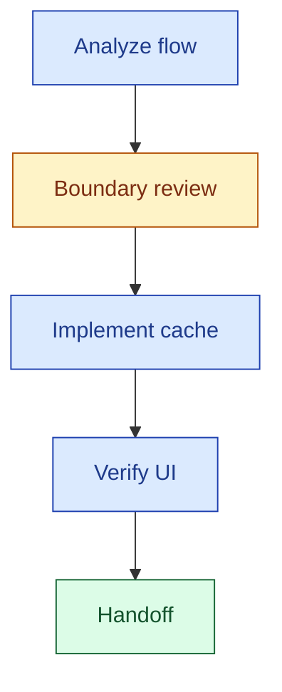
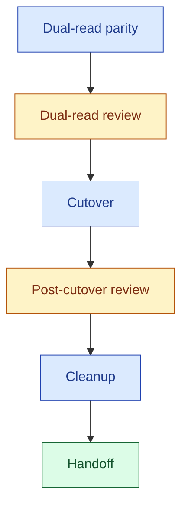
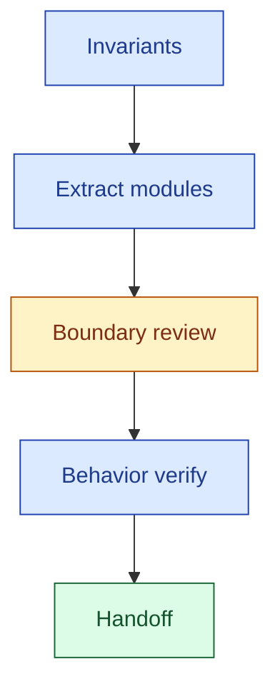
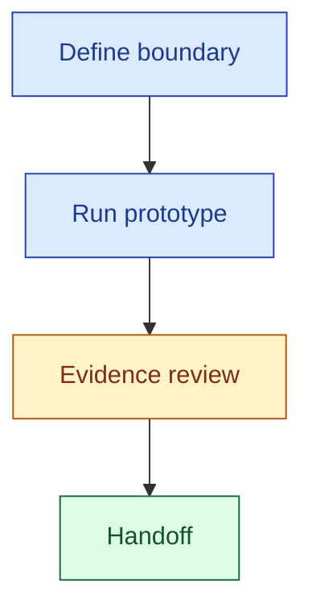

# Write Executable Plan Examples

Use these examples as patterns, not rigid boilerplate.

## How to Read These Examples

These examples are **not** universal best practices for every case.

They exist to show what a strong executable-plan pattern looks like under a particular task shape. When adapting them:

- preserve the contract-quality signals
- adapt the domain details to the actual work
- avoid copying the surface form blindly

When reading a positive example, ask:

- What makes this example executable in general?
- Which parts define quality boundaries?
- Which parts are case-specific and should be replaced?

When reading a negative example, ask:

- Which contract obligations are missing?
- Why would a downstream agent struggle with this shape?
- What is the smallest change that restores executability?

## Example 1 — `delivery`

Save as: `plan.delivery.search-suggestions-cache.md`

````markdown
# Add Cached Search Suggestions

**Goal:** Add search suggestions with a short-lived cache so users see faster results while typing.
**Task Type:** `search-suggestions-cache`
**Contract Profile:** `delivery`
**Mode:** `credit-rich`
**Primary Success Signal:** Typing in the search box shows relevant suggestions, and repeated queries avoid redundant backend work.

## Inputs / Context Sources
- `src/search/SearchBox.tsx`
- `src/search/searchApi.ts`
- `src/server/search/suggestions.ts`
- `src/search/__tests__/SearchBox.test.tsx`
- Product note: suggestions should remain fresh within a short typing session

## Context Scope
- Use only the listed files and product note as required local context.
- Do not assume broader repository exploration unless these files expose a real gap.

## Output
Cache-aware suggestion fetch at the search API layer, with existing UI behavior preserved and unit coverage updated.

## Dependency Graph



## Stages

### s1: Analyze the current suggestion path

**Purpose:** Determine where suggestions are requested today and where cache ownership should live.
**Files:** `src/search/SearchBox.tsx`, `src/search/searchApi.ts`, `src/server/search/suggestions.ts`
**Exit Signal:** The cache boundary is clear enough to implement without guesswork.
**Checklist:**
- [ ] Read the current suggestion request path from UI to backend
- [ ] Identify where duplicate work currently happens
- [ ] Choose the cache boundary

### ck1: Cache boundary review

**Purpose:** Verify the chosen boundary carries clear ownership and invalidation semantics before any cache code lands.
**Mode:** auto_review
**Exit Signal:** All pass criteria green.
**Checklist:**
- [ ] Cache ownership is unambiguous (API layer vs UI vs backend)
- [ ] Invalidation scope is understood
- [ ] No cross-feature freshness risk is unresolved
**On Fail:** revise_plan

### s2: Implement cache-aware behavior

**Purpose:** Introduce caching at the chosen boundary without changing visible behavior.
**Files:** `src/search/searchApi.ts`, `src/server/search/suggestions.ts`, `src/search/__tests__/SearchBox.test.tsx`
**Exit Signal:** Cache behavior is in place and the suggestion tests pass.
**Checklist:**
- [ ] Add cache-aware fetch behavior
- [ ] Record TTL and invalidation assumptions in code comments
- [ ] Update the relevant test path

### s3: Verify user-facing behavior

**Purpose:** Confirm the UI still behaves correctly after the cache change.
**Files:** `src/search/SearchBox.tsx`, `src/search/__tests__/SearchBox.test.tsx`
**Exit Signal:** Suggestion rendering and repeated-query behavior are both acceptable.
**Checklist:**
- [ ] Exercise the UI suggestion path
- [ ] Confirm repeated queries reuse cached results where expected
- [ ] Confirm loading and error behavior still make sense

### h: Handoff

**Purpose:** Confirm the cached suggestion path is safe to ship.
**Exit Signal:** Every earlier `## Stage Claims` entry is `[x]` and the Primary Success Signal holds.
**Checklist:**
- [ ] All prior `## Stage Claims` entries are `[x]`
- [ ] Primary Success Signal holds
- [ ] No unresolved freshness or invalidation questions remain

## Verification
- Run the relevant UI or unit tests for search suggestions.
- Manually verify that repeated queries within the short window avoid redundant work.
- Confirm loading and error states still behave correctly.

## Decision Points
- When cache placement requires a broader data invalidation strategy.
- When the suggestion flow is more distributed than the current context shows.

## Decision Log
- Decision: Put caching in the API layer rather than the UI component.
  Why: It keeps the cache reusable across multiple consumers.

## Debug Log Standard

> **Standard — include verbatim**; points the executor to the debug log format this plan follows when the debug loop is entered.
>
> Format: `debug_log_template.md` (see also `reference.md` → Debug Log Format). Trigger: debug loop (`reference.md` → Execution Policy: Debug Loop). Filename: `debug.<contract-profile>.<task-type>.<MMDDHHMM>.md` (executor fills the placeholders at session start).

## Stage Claims

> **Runtime coordination ledger** — composer seeds one `- [ ]` entry per DAG node (stages `s*`, checkpoints `ck*`, handoff `h`). Executors update in place:
>
> - `- [ ] <id>: <label>` — unclaimed
> - `- [~] <id>: <label> — <agent-id> @ <MMDDHHMM>` — claimed, in progress
> - `- [x] <id>: <label> — <agent-id> @ <MMDDHHMM>` — done
>
> See `reference.md` → Stage Claims for the full claim protocol.

- [ ] s1: Analyze the current suggestion path
- [ ] ck1: Cache boundary review
- [ ] s2: Implement cache-aware behavior
- [ ] s3: Verify user-facing behavior
- [ ] h: Handoff
````

### Why this positive example works

This is a strong example **in general** because it does not rely on domain familiarity to stay executable.

- It declares the work label, contract profile, and mode up front, so the downstream agent knows how to interpret the plan.
- It grounds the plan in explicit context sources instead of assuming hidden knowledge.
- The `## Dependency Graph` declares structure — `ck1` sits between `s1` and `s2` because the boundary decision is the first irreversible commitment. The executor, not the plan, decides whether to run the downstream nodes serially or in parallel.
- Each stage carries purpose + files + exit signal + checklist, so the executor has both work scope and a completion criterion.
- The `h` handoff node lists concrete plan-specific sign-off items rather than a free-form closer.
- `## Stage Claims` seeds one ledger entry per DAG node so multiple executors — or a resuming executor — can coordinate without collision.

General lesson:

- A positive example is good when it clarifies boundaries, verification, and failure handling.
- A positive example is **not** good merely because it looks polished or detailed.

## Example 2 — `migration`

Use this pattern when rollout risk is meaningful and the plan needs explicit review gates before and after the irreversible step.

Save as: `plan.migration.payment-read-migration.md`

````markdown
# Migrate Payment Reads to New Store

**Goal:** Move payment reads to the new store without breaking existing user-visible behavior.
**Task Type:** `payment-read-migration`
**Contract Profile:** `migration`
**Mode:** `credit-rich`
**Primary Success Signal:** The system can verify parity in dual-read mode before cutover, and rollback remains cheap throughout.

## Inputs / Context Sources
- `src/data/read_path.ts`
- `src/data/new_store.ts`
- `src/data/__tests__/read_path.test.ts`
- operational requirement: cutover must remain reversible during rollout

## Context Scope
- Use only the listed data-path files and stated operational requirement as required local context.
- Treat broader rollout assumptions as unknown until explicitly provided.

## Output
Dual-read instrumentation, cutover switch, and staged cleanup of the legacy read path — all gated by explicit parity and stability reviews.

## Dependency Graph



## Stages

### s1: Establish dual-read parity

**Purpose:** Compare old and new reads before any cutover.
**Files:** `src/data/read_path.ts`, `src/data/new_store.ts`, `src/data/__tests__/read_path.test.ts`
**Exit Signal:** Parity is understood well enough to evaluate cutover readiness.
**Checklist:**
- [ ] Enable or simulate dual-read behavior
- [ ] Compare representative old-path and new-path outputs
- [ ] Record mismatch behavior and tolerance assumptions

### ck1: Dual-read review

**Purpose:** Go/no-go gate before the irreversible cutover.
**Mode:** auto_review
**Exit Signal:** All pass criteria green; if not, escalate or extend dual-read.
**Checklist:**
- [ ] Mismatch rate is within the agreed tolerance
- [ ] Rollback path is documented and cheap to trigger
- [ ] Monitoring and alerting for the new path are in place
**On Fail:** extend_dual_read → escalate

### s2: Cutover

**Purpose:** Switch authoritative reads from the old store to the new store.
**Files:** `src/data/read_path.ts`, `docs/rollout/payment-read-migration.md`
**Exit Signal:** The new store serves reads in production and the rollback switch is still armed.
**Checklist:**
- [ ] Flip read authority to the new store via the documented switch
- [ ] Verify the cutover with a short live-traffic check
- [ ] Keep the rollback switch reachable and tested

### ck2: Post-cutover review

**Purpose:** Confirm stability is real before removing any rollback scaffolding.
**Mode:** auto_review
**Exit Signal:** All pass criteria green; if not, delay cleanup.
**Checklist:**
- [ ] Cutover has run for long enough to surface regressions
- [ ] Rollback remains reversible and has been exercised in a drill
- [ ] Cleanup will not remove rollback support prematurely
**On Fail:** delay_cleanup → reinstate_previous_path

### s3: Cleanup

**Purpose:** Retire the legacy read path once the post-cutover review has passed.
**Files:** `src/data/read_path.ts`, `docs/rollout/payment-read-migration.md`
**Exit Signal:** The old path is removed and documentation reflects the final state.
**Checklist:**
- [ ] Remove the legacy read code and its direct callers
- [ ] Update rollout/runbook documentation
- [ ] Close out the migration decision entry in `## Decision Log`

### h: Handoff

**Purpose:** Confirm the migration is complete and reversible-by-design guarantees are retired cleanly.
**Exit Signal:** Every earlier `## Stage Claims` entry is `[x]` and the Primary Success Signal holds.
**Checklist:**
- [ ] All prior `## Stage Claims` entries are `[x]`
- [ ] Primary Success Signal holds (parity verified, cutover stable, rollback cleanly retired)
- [ ] Runbook and decision log reflect the final state

## Verification
- Run read-path tests before and after dual-read instrumentation.
- Compare old-path and new-path results on representative staging inputs.
- Confirm the rollback step can be exercised without code redesign before cutover, and confirm it has been exercised at least once before cleanup.

## Decision Points
- When the parity check reveals unexplained mismatches.
- When rollback cannot be performed cheaply after cutover.
- When post-cutover stability is unclear at the cleanup gate.

## Rollout / Rollback
- Rollout: enable dual-read first, evaluate mismatch rate, then cut over.
- Rollback: disable the new read path and keep the old path authoritative — must remain viable until `ck2` passes.

## Compatibility / Migration
- Keep the old read path authoritative until `ck1` passes.
- Do not remove the old path in the same stage as initial cutover; removal is gated on `ck2`.

## Risks & Mitigations
- Risk: silent data mismatch between old and new stores.
  Mitigation: stay in dual-read mode until parity is understood and `ck1` passes.
- Risk: rollback is slower than expected during incident response.
  Mitigation: define and drill the rollback switch before cutover; `ck2` re-checks it.

## Decision Log
- Decision: Added explicit `ck1` and `ck2` gates around cutover.
  Why: Cutover risk and cleanup risk are both too high to allow uninterrupted progression.

## Debug Log Standard

> **Standard — include verbatim**; points the executor to the debug log format this plan follows when the debug loop is entered.
>
> Format: `debug_log_template.md` (see also `reference.md` → Debug Log Format). Trigger: debug loop (`reference.md` → Execution Policy: Debug Loop). Filename: `debug.<contract-profile>.<task-type>.<MMDDHHMM>.md` (executor fills the placeholders at session start).

## Stage Claims

> **Runtime coordination ledger** — composer seeds one `- [ ]` entry per DAG node (stages `s*`, checkpoints `ck*`, handoff `h`). Executors update in place:
>
> - `- [ ] <id>: <label>` — unclaimed
> - `- [~] <id>: <label> — <agent-id> @ <MMDDHHMM>` — claimed, in progress
> - `- [x] <id>: <label> — <agent-id> @ <MMDDHHMM>` — done
>
> See `reference.md` → Stage Claims for the full claim protocol.

- [ ] s1: Establish dual-read parity
- [ ] ck1: Dual-read review
- [ ] s2: Cutover
- [ ] ck2: Post-cutover review
- [ ] s3: Cleanup
- [ ] h: Handoff
````

### Why this checkpoint/migration example works

This is a strong example **in general** because it turns migration risk into explicit DAG structure and contract sections.

- `ck1` sits immediately upstream of the irreversible node (`s2`, the cutover) — this is one of the structural triggers for inserting an explicit checkpoint node.
- `ck2` sits before `s3` (cleanup) so rollback scaffolding is never removed while stability is still uncertain.
- Rollout, rollback, compatibility, and risk sections exist because the `migration` contract profile makes them required, not because the plan author added them decoratively.
- Verification ties back to operational reality (staging comparisons, rollback drills), not only static tests.

General lesson:

- A migration plan is good when reversibility and compatibility are first-class contract structure.
- A checkpoint is useful when the next node would be expensive or impossible to undo.
- A checkpoint should state what is being reviewed (`Purpose`), how a pass looks (`Checklist` pass criteria), and what happens on failure (`On Fail`).

## Example 3 — `refactor`

Save as: `plan.refactor.reporting-service-split.md`

````markdown
# Split Reporting Service into Smaller Modules

**Goal:** Improve maintainability of the reporting service without changing its public behavior.
**Task Type:** `reporting-service-split`
**Contract Profile:** `refactor`
**Mode:** `credit-rich`
**Primary Success Signal:** Existing report generation behavior remains intact while responsibilities are split into smaller modules.

## Inputs / Context Sources
- `src/reporting/ReportingService.ts`
- `src/reporting/__tests__/ReportingService.test.ts`
- current constraint: no public API changes during this refactor

## Context Scope
- Use the reporting service files and the no-public-API-change constraint as the bounded local context.
- Do not widen scope into interface redesign unless the current files force that conclusion.

## Output
Reporting service split into smaller internal modules, with the public API unchanged and existing tests still green.

## Dependency Graph



## Stages

### s1: Make invariants explicit

**Purpose:** Identify what must remain stable before changing internals.
**Files:** `src/reporting/ReportingService.ts`, `src/reporting/__tests__/ReportingService.test.ts`
**Exit Signal:** Stable behaviors and extraction boundaries are explicit and testable.
**Checklist:**
- [ ] Map current responsibilities
- [ ] Identify invariants that must remain unchanged
- [ ] Confirm tests actually guard those invariants (add tests if they do not)

### s2: Extract internal responsibilities safely

**Purpose:** Split internals without changing the public surface.
**Files:** `src/reporting/ReportingService.ts`, `src/reporting/formatters.ts`, `src/reporting/filters.ts`
**Exit Signal:** Internal modules are clearer and the public API still behaves the same.
**Checklist:**
- [ ] Extract one cohesive internal concern at a time
- [ ] Re-run behavior checks after each extraction
- [ ] Keep the public API signature and behavior stable

### ck1: Refactor boundary review

**Purpose:** Verify the extracted modules respect the refactor contract before final verification.
**Mode:** auto_review
**Exit Signal:** All pass criteria green.
**Checklist:**
- [ ] Public behavior is still stable (test suite passes against both old and new shape)
- [ ] Extraction boundaries are coherent — no leaky helpers across modules
- [ ] No extraction has forced a public API change
**On Fail:** revise_plan — or reclassify the work if a public API change is truly unavoidable

### s3: Behavior verification

**Purpose:** Confirm end-to-end that the refactor preserved behavior.
**Files:** `src/reporting/ReportingService.ts`, `src/reporting/__tests__/ReportingService.test.ts`
**Exit Signal:** Reports produced before and after the refactor are equivalent on representative inputs.
**Checklist:**
- [ ] Run the existing reporting tests
- [ ] Compare one representative report output before and after the refactor
- [ ] Record any behavior-adjacent changes for review

### h: Handoff

**Purpose:** Confirm the refactor is complete and behavior-preserving.
**Exit Signal:** Every earlier `## Stage Claims` entry is `[x]` and the Primary Success Signal holds.
**Checklist:**
- [ ] All prior `## Stage Claims` entries are `[x]`
- [ ] Primary Success Signal holds (public behavior intact, internal split in place)
- [ ] No follow-up scope has silently leaked into this refactor

## Verification
- Run the existing reporting tests after each extraction step.
- Compare one representative report output before and after the refactor.

## Decision Points
- When behavior-preserving boundaries are not clear.
- When an extraction would force a public API change that the current goal does not allow.

## Decision Log
- Decision: Preserve the public API and postpone interface cleanup.
  Why: The task is a behavior-preserving refactor, not a redesign.

## Debug Log Standard

> **Standard — include verbatim**; points the executor to the debug log format this plan follows when the debug loop is entered.
>
> Format: `debug_log_template.md` (see also `reference.md` → Debug Log Format). Trigger: debug loop (`reference.md` → Execution Policy: Debug Loop). Filename: `debug.<contract-profile>.<task-type>.<MMDDHHMM>.md` (executor fills the placeholders at session start).

## Stage Claims

> **Runtime coordination ledger** — composer seeds one `- [ ]` entry per DAG node (stages `s*`, checkpoints `ck*`, handoff `h`). Executors update in place:
>
> - `- [ ] <id>: <label>` — unclaimed
> - `- [~] <id>: <label> — <agent-id> @ <MMDDHHMM>` — claimed, in progress
> - `- [x] <id>: <label> — <agent-id> @ <MMDDHHMM>` — done
>
> See `reference.md` → Stage Claims for the full claim protocol.

- [ ] s1: Make invariants explicit
- [ ] s2: Extract internal responsibilities safely
- [ ] ck1: Refactor boundary review
- [ ] s3: Behavior verification
- [ ] h: Handoff
````

### Why this refactor example works

This is a strong example **in general** because it treats preservation of behavior as a first-class contract concern.

- It makes invariants explicit (`s1`) before any code movement begins.
- The checkpoint `ck1` sits after the extraction work but before final verification, so boundary problems are caught while the diff is still small.
- It avoids accidentally turning a refactor into a redesign; `On Fail` for `ck1` names "reclassify the work" as the correct response when a public API change becomes unavoidable.

General lesson:

- A refactor example is good when it defines what must stay stable and sequences the work around safe extraction boundaries.
- A refactor example is **not** good when it focuses only on internal cleanliness with no guardrails for behavior preservation.

## Example 4 — `exploration`

Save as: `plan.exploration.vector-search-feasibility-experiment.md`

````markdown
# Prototype Vector Search for Help Content

**Goal:** Determine whether vector search is a viable replacement for the current substring search on help content.
**Task Type:** `vector-search-feasibility-experiment`
**Contract Profile:** `exploration`
**Mode:** `budget-limited`
**Primary Success Signal:** The prototype produces enough evidence to recommend proceed, defer, or reject — without expanding into production implementation.

## Inputs / Context Sources
- `src/help/search.ts`
- `docs/help-search-requirements.md`
- user note: prioritize fast feasibility over exhaustive analysis

## Context Scope
- Use only the listed files and user note as the required context for this bounded prototype.
- Treat broader architectural questions as out of scope unless the provided context makes them unavoidable.

## Output
A short written recommendation (proceed / defer / reject) backed by a minimal prototype and one quality + one cost observation.

## Dependency Graph



## Stages

### s1: Define the prototype boundary

**Purpose:** Keep the experiment small enough to answer the decision question without becoming implementation work.
**Files:** `src/help/search.ts`, `experiments/vector_search_prototype.py`
**Exit Signal:** The experiment scope fits on one page and produces one go/no-go answer.
**Checklist:**
- [ ] Define the smallest useful experiment boundary
- [ ] Confirm the result can support a proceed/defer/reject recommendation
- [ ] Flag "cannot answer without production integration" as a stop condition

### s2: Run prototype and produce recommendation

**Purpose:** Gather bounded evidence and write down the recommendation.
**Files:** `experiments/vector_search_prototype.py`, `notes/vector-search-results.md`
**Exit Signal:** A written recommendation exists with at least one quality and one cost observation.
**Checklist:**
- [ ] Run the prototype on a representative slice
- [ ] Record one quality comparison (relevance vs substring baseline)
- [ ] Record one cost or complexity observation (latency, index size, or deployment surface)
- [ ] Write the recommendation as proceed / defer / reject

### ck1: Scope and evidence review

**Purpose:** Make sure the recommendation is grounded and the exploration has not silently expanded into production design.
**Mode:** auto_review
**Exit Signal:** All pass criteria green.
**Checklist:**
- [ ] The recommendation is supported by the recorded observations
- [ ] The work has not expanded into a production rewrite
- [ ] Follow-up scope (if any) is noted as a separate plan, not absorbed here
**On Fail:** narrow_the_scope — or stop with a "more evidence needed" recommendation

### h: Handoff

**Purpose:** Confirm the bounded feasibility question has been answered.
**Exit Signal:** Every earlier `## Stage Claims` entry is `[x]` and the Primary Success Signal holds.
**Checklist:**
- [ ] All prior `## Stage Claims` entries are `[x]`
- [ ] A recommendation (proceed / defer / reject) is on file
- [ ] Any follow-up work is captured as a separate plan, not appended here

## Verification
- Confirm the prototype can be executed from the available context.
- Record whether the prototype supports proceed, defer, or reject.

## Decision Points
- When the experiment boundary expands into a production rewrite.
- When the available context is insufficient to make a bounded recommendation.

## Sources / Rationale
- Use current code and the provided requirements as the only required grounding sources in this mode.

## Proposed Deliverables
- `experiments/vector_search_prototype.py` — exploratory code, not maintained
- `notes/vector-search-results.md` — measurement notes

## Committed Deliverables
- `notes/vector-search-recommendation.md` — proceed/defer/reject decision memo

## Decision Log
- Decision: Use `budget-limited` mode for the prototype.
  Why: The immediate goal is bounded feasibility, not production design completeness.

## Debug Log Standard

> **Standard — include verbatim**; points the executor to the debug log format this plan follows when the debug loop is entered.
>
> Format: `debug_log_template.md` (see also `reference.md` → Debug Log Format). Trigger: debug loop (`reference.md` → Execution Policy: Debug Loop). Filename: `debug.<contract-profile>.<task-type>.<MMDDHHMM>.md` (executor fills the placeholders at session start).

## Stage Claims

> **Runtime coordination ledger** — composer seeds one `- [ ]` entry per DAG node (stages `s*`, checkpoints `ck*`, handoff `h`). Executors update in place:
>
> - `- [ ] <id>: <label>` — unclaimed
> - `- [~] <id>: <label> — <agent-id> @ <MMDDHHMM>` — claimed, in progress
> - `- [x] <id>: <label> — <agent-id> @ <MMDDHHMM>` — done
>
> See `reference.md` → Stage Claims for the full claim protocol.

- [ ] s1: Define the prototype boundary
- [ ] s2: Run prototype and produce recommendation
- [ ] ck1: Scope and evidence review
- [ ] h: Handoff
````

### Why this exploration example works

This is a strong example **in general** because it keeps uncertainty bounded instead of pretending to know more than the context allows.

- It narrows the goal to a decision, not a full implementation.
- It uses `budget-limited` mode intentionally — fewer nodes, tighter debug-loop budget at runtime.
- It makes "recommend proceed / defer / reject" part of the deliverable.
- It distinguishes between `Proposed Deliverables` (prototype artifacts, maybe thrown away) and `Committed Deliverables` (the recommendation memo, which outlives the experiment).
- `ck1` explicitly guards against scope expansion, which is the main failure mode for exploration plans.

General lesson:

- An exploration example is good when it protects scope boundaries under uncertainty.
- An exploration example is **not** good when it expands into implementation by accident.

## Example 5 — Fallback Example Pattern

When there is no perfect example for the current contract profile:

1. Start from the nearest contract-profile example.
2. Reuse only the sections that match the current risk profile.
3. Add a local anti-ambiguity note instead of inventing fake certainty.

Partial skeleton — minimum viable fragment when falling back to the core checklist:

```markdown
## Context Scope
- Use only the attached interface files.

## Dependency Graph
s1 --> h

## Stages
### s1: Clarify interface ownership

**Purpose:** Confirm who owns the interface before making changes.
**Checklist:**
- [ ] Identify the current interface owner
- [ ] Flag "ownership still unclear" as a stop condition

### h: Handoff

**Purpose:** Confirm ownership is resolved and the follow-up plan can begin.
**Checklist:**
- [ ] Ownership is resolved or explicitly escalated
```

## Example 6 — Anti-Pattern

Avoid plans like this:

```markdown
# Improve Search

## Stages
### s1: Do some work
- [ ] Update backend
- [ ] Update frontend
- [ ] Add tests
```

Why this fails the contract:

- No `Task Type`, `Contract Profile`, `Mode`, or `Primary Success Signal` — downstream agents cannot interpret the plan.
- No `Inputs / Context Sources` or `Context Scope` — no grounding, so the executor has to invent context.
- No `Output` — no sketch of what the plan actually produces.
- No `Dependency Graph` — there is no structural contract at all, so the executor cannot reason about parallelism, claims, or the terminal handoff.
- No `## Stage Claims` ledger and no `h` handoff node — nothing to coordinate around and no sign-off criterion.
- No `Verification`, `Decision Points`, or `Debug Log Standard` — the runtime policy is undefined.
- The single stage is a category label ("Do some work") rather than an executable unit: purpose, exit signal, and files are all missing.

Why this is weak **in general**:

- It names work categories, not executable tasks.
- It assumes the next agent already knows where to work and how to validate success.
- It provides no mechanism for stopping when the plan becomes unsafe or ambiguous.

General lesson:

- A negative example is useful when it reveals a class of failure, not just one bad snippet.
- The point is to identify the missing contract signals and restore them deliberately — most of them are mechanically enforced by `scripts/validate-plan.py`.

## Example 7 — Debug Log

Save as: `debug.delivery.search-suggestions-cache.04171630.md`

````markdown
# Debug Log for plan.delivery.search-suggestions-cache

**Plan:** `plan.delivery.search-suggestions-cache.md`
**Started:** 04171630
**Context:** Node `s2` (Implement cache-aware behavior) failed — cache-aware fetch returns stale results after invalidation.

## Session 1 — 04171632

**Blocker:** Repeated queries after invalidation still return cached values.
**Hypothesis:** The cache key does not include an invalidation epoch, so invalidation cannot actually evict anything.
**Approach:** Add an epoch-qualified cache key.
**Diff from previous:** N/A

### Patch
```diff
--- a/src/search/searchApi.ts
+++ b/src/search/searchApi.ts
@@ -12,7 +12,8 @@ export async function fetchSuggestions(query: string) {
-  const key = `suggestions:${query}`;
+  const epoch = getCacheEpoch();
+  const key = `suggestions:${epoch}:${query}`;
   const cached = cache.get(key);
```

### Recovery
`git checkout src/search/searchApi.ts` to restore the original key logic. No backup file needed.

### Result
Failed. The invalidation path never bumps the epoch, so key qualification alone does not evict stale entries.

## Session 2 — 04171651

**Blocker:** Same symptom as Session 1.
**Hypothesis:** The missing link is on the invalidation side, not the read side. `invalidateSuggestions()` does not touch the cache epoch.
**Approach:** Bump `getCacheEpoch()` inside `invalidateSuggestions()` so invalidation events propagate through the key.
**Diff from previous:** Shifts focus from the read path (Session 1) to the invalidation hook. Different root cause: missing producer, not missing consumer.

### Patch
```diff
--- a/src/server/search/suggestions.ts
+++ b/src/server/search/suggestions.ts
@@ -33,6 +33,7 @@ export function invalidateSuggestions() {
+  bumpCacheEpoch();
   clearLocalCaches();
 }
```

### Recovery
`git checkout src/server/search/suggestions.ts` to remove the hook. The Session 1 patch is preserved and still valid.

### Result
Succeeded. Repeated queries after invalidation now return fresh suggestions. Node `s2` can continue.
````

### Why this debug log example works

- Each session declares an explicit hypothesis and a `**Diff from previous:**` line that makes the shift visible — this is how the contract distinguishes a real new approach from a superficial retry.
- Each patch has a matching recovery instruction, so reviewers can verify the reversibility claim without guessing.
- Sessions are short and focused; the log captures the failure mode of Session 1 rather than hiding it.
- The log demonstrates that escalation was not needed: the bounded debug loop resolved the blocker within two sessions.
- The `Context` line references the blocked node by its DAG id (`s2`), which is how the executor will reference it back in the runtime ledger.

General lesson:

- A debug log is executable evidence of the debug loop, not a journal.
- It proves that the agent honored the bounded protocol and that every attempt was reversible.
- Its audience is a reviewing human or follow-up agent who must quickly decide whether the attempted fix is safe to keep or needs to be rolled back.

## Example 8 — Problem Framing

This example shows what a **coarse conceptual model** looks like as a Problem Framing artifact (Composer Workflow Step 3). The composer produces it from assembled context, before any decomposition. It is deliberately abstract: the artifact captures shape, not implementation.

```markdown
**Objective:** Measure which of two attention-kernel implementations — A (fused) and B (unfused) — is faster on the target inference workload.

**Inputs / environment:**
- Both kernel implementations in their current state
- A GPU with enough memory for the target workload
- Representative input shapes drawn from the inference pipeline

**Expected output:**
A small comparison table: latency and throughput for A and B under the chosen workload, plus a recommendation row picking one for production.

**Back-match to requirement:**
The requirement asks "pick the faster kernel under realistic workload". The table answers latency/throughput directly, and the recommendation row closes the decision.

**Assumptions & unknowns:**
- Assumption: both implementations compile and run without modification
- Unknown: which input-shape distribution best represents "realistic workload"
- Unknown: whether numerical parity between A and B must be verified separately
```

### Why this frame stays coarse

Each slot trades precision for shape:

- **Inputs / environment**: "a GPU with enough memory", not "B200 with 192GB HBM at 1.8GHz" — captures the capability, not the SKU or clock.
- **Inputs / environment**: "representative input shapes", not "M=1024, K=4096, N=512 with batch 32" — captures the kind of input, not a parameter grid.
- **Expected output**: "a small comparison table", not "500 warmup + 1000 measurement iterations with 5 seed replicates" — captures the artifact shape, not the measurement protocol.
- **Assumptions & unknowns**: explicit and external, not hidden commitments; these feed directly into the `Clarify Gaps` step.

### What going too fine would look like

If the frame starts pinning SKUs, iteration counts, or exact shape grids, it stops being a frame and becomes an implementation plan. The job of `Top-down Decompose` (Step 5) is to refine specifics; if the frame pre-empts that, decomposition loses room to breathe.

General lesson:

- A Problem Framing artifact is good when it closes the loop between requirement and expected output, with assumptions stated.
- A Problem Framing artifact is **not** good when it commits to implementation specifics the composer has no basis to commit to yet.

## Minimal Recovery Pattern

If the plan is getting too vague, recover by adding these pieces first — roughly in the order they appear in [`plan_template.md`](plan_template.md):

```markdown
**Task Type:** `...`
**Contract Profile:** `...`
**Mode:** `...`
**Primary Success Signal:** ...

## Inputs / Context Sources
...

## Context Scope
...

## Output
...

## Dependency Graph
s1 --> h

## Stages

### s1: ...
**Purpose:** ...
**Exit Signal:** ...
**Checklist:**
- [ ] ...

### h: Handoff
**Purpose:** Confirm the work is complete.
**Checklist:**
- [ ] All prior `## Stage Claims` entries are `[x]`
- [ ] Primary Success Signal holds

## Verification
...

## Decision Points
...

## Decision Log
...

## Debug Log Standard

> **Standard — include verbatim**; points the executor to the debug log format this plan follows when the debug loop is entered.
>
> Format: `debug_log_template.md` (see also `reference.md` → Debug Log Format). Trigger: debug loop (`reference.md` → Execution Policy: Debug Loop). Filename: `debug.<contract-profile>.<task-type>.<MMDDHHMM>.md` (executor fills the placeholders at session start).

## Stage Claims

- [ ] s1: ...
- [ ] h: Handoff
```

### How to improve a weak example

In general, the smallest useful repair is:

1. declare the task type label and contract profile
2. choose the execution mode (default `credit-rich` unless leanness is requested)
3. add the real context sources and define `Context Scope`
4. sketch the `Output` — one or two lines is enough
5. declare the `## Dependency Graph` with `s*` stage nodes and the mandatory `h` handoff sink
6. turn vague bullets into per-node `Purpose` / `Checklist` / `Exit Signal`
7. add `Verification` and `Decision Points` so runtime behavior is defined
8. keep `## Debug Log Standard` verbatim and seed `## Stage Claims` with one entry per DAG node

The goal is not to make the plan longer. The goal is to make it executable — run `python scripts/validate-plan.py <plan-file>` to confirm the mechanical contract holds.
