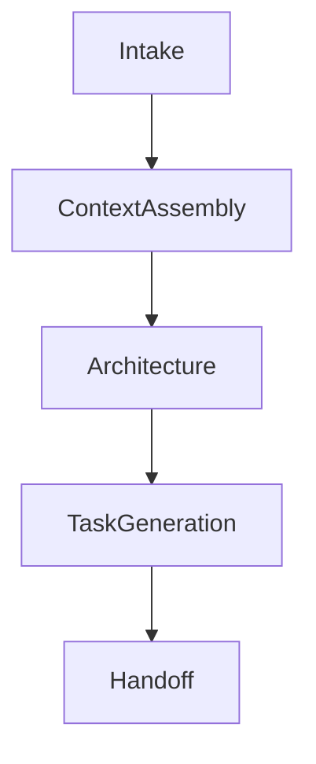

# Write Executable Plan Reference

This file defines the plan contract used by `write-executable-plan`.

## 1. Core Contract

Every generated plan must include the following top-level structure:

```markdown
# <Plan Title>

**Goal:** <one-sentence objective>
**Task Type:** `<free-form label such as search-enhancement, payment-read-migration, reporting-refactor, feasibility-experiment>`
**Contract Profile:** `<delivery|refactor|migration|exploration>`
**Mode:** `<credit-rich|budget-limited>`
**Primary Success Signal:** <what proves the plan succeeded>

## Inputs / Context Sources
<what the plan is grounded in>

## Context Scope
<which local materials are allowed as evidence or input>

## Flow Graph
<phase graph and transition intent>

## Stages
<stage-by-stage job groupings with checklists>

## Verification
<how to validate key milestones and the final outcome>

## Stop Conditions
<when the next agent must stop and ask or revise>

## Decision Log
<important plan mutations and why they happened>

## Handoff
<how the next agent should continue from here>
```

The core contract defines the minimum safe structure. It does **not** require every plan to prescribe identical implementation behavior.

Schema rule:

- `Task Type` is an open-ended label that describes the actual nature of the work.
- `Contract Profile` is the controlled enum that determines which contract shape to apply.

## 2. Stage-Level Contract

Every plan must define stages. A stage is a job grouping, not a mandatory serial execution step.

Default stage shape:

```markdown
### Stage N: <Stage Name>

**Purpose:** <what this stage is responsible for>
**Files:** `<repo-relative path>`, `<repo-relative path>`
**Exit Signal:** <what tells the next agent this stage is ready to transition>
**Checklist:**
[ ] <job A>
[ ] <job B>
```

Stage-field requiredness:

| Stage Field | Rule |
|---|---|
| `Purpose` | Required |
| `Checklist` | Required |
| `Files` | Recommended |
| `Exit Signal` | Recommended |

Rules:

- `Files` is recommended when stage boundaries touch concrete repo areas.
- `Exit Signal` is recommended when the handoff between stages would otherwise be ambiguous.
- In `budget-limited` mode, recommended fields may be omitted if the stage remains clearly executable without them.

Guidance:

- Prefer exact repo-relative file paths whenever possible.
- Use stage purpose, checklist, and verification to preserve agent creativity without losing execution clarity.
- Add code snippets only when the pattern is fragile or non-obvious.
- Avoid turning the plan into a shell script unless that is truly the right artifact.

## 3. Contract Profiles

Every plan picks one primary contract profile.

### `delivery`

Use when the goal is a user-visible capability or new workflow.

Required emphasis:

- user-visible outcome
- acceptance walkthrough
- file ownership
- verification of the happy path

Recommended additional sections:

- `Risks & Mitigations`
- `Sources / Rationale` when the design is not obvious

### `refactor`

Use when the goal is structural improvement while preserving behavior.

Required emphasis:

- invariants to preserve
- compatibility expectations
- rollback-friendly sequencing
- proof that behavior remains intact

Recommended additional sections:

- `Non-Goals`
- `Compatibility / Migration` if the refactor affects interfaces

### `migration`

Use when the work changes data shape, rollout path, operational behavior, or backward compatibility.

Required emphasis:

- rollout path
- rollback path
- compatibility boundary
- observability / verification during rollout

Required additional sections:

- `Rollout / Rollback`
- `Compatibility / Migration`
- `Risks & Mitigations`

### `exploration`

Use when uncertainty is high and the immediate goal is to validate feasibility or de-risk direction.

Required emphasis:

- hypothesis
- prototype boundary
- success / discard criteria
- promotion path into implementation work

Recommended additional sections:

- `Sources / Rationale`
- `Checkpoint Notes`

## 4. Required vs Conditional Sections

Use this table when deciding what belongs in the generated plan.

| Section | Rule |
|---|---|
| `Goal` | Required |
| `Task Type` | Required |
| `Contract Profile` | Required |
| `Mode` | Required |
| `Primary Success Signal` | Required |
| `Inputs / Context Sources` | Required |
| `Context Scope` | Required |
| `Flow Graph` | Required |
| `Stages` | Required |
| `Verification` | Required |
| `Stop Conditions` | Required |
| `Decision Log` | Required |
| `Handoff` | Required |
| `Proposed Deliverables` | Conditional |
| `Committed Deliverables` | Conditional |
| `Risks & Mitigations` | Conditional |
| `Rollout / Rollback` | Conditional |
| `Compatibility / Migration` | Conditional |
| `Metrics / KPI` | Conditional |
| `Sources / Rationale` | Conditional |

Rules:

- `Conditional` means the section is required only when the contract profile, risk profile, or user request demands it.
- When in doubt, prefer the smallest contract that still keeps execution safe.

## 5. Flow Graph and Checkpoints

The plan should model major phases explicitly.

The plan has one overall `Goal`. A checkpoint is **not** a sub-goal. It is a pause-and-review control point inserted on a transition between phases.

Example:



Checkpoint policy:

- Treat checkpoints as transition-level review jobs, not ordinary build steps.
- Default checkpoint mode is `auto_review`.
- Use `human_review` only when the user explicitly wants involvement or when a high-risk ambiguity remains unresolved.
- Use `hybrid` when automatic review should happen first and human escalation is only a fallback.

Checkpoint object shape:

```yaml
transitions:
  - from: architecture
    to: task-generation
    checkpoint:
      id: architecture-review
      mode: auto_review | human_review | hybrid
      review_focus:
        - architecture boundaries
        - dependency order
      continue_if:
        - boundaries are clear
        - dependencies are acyclic
        - no critical ambiguity remains
      on_fail:
        - revise_plan
        - or_stop_for_clarification
```

Placement rule:

- Keep checkpoint object definitions directly under `## Flow Graph` or under a nested subsection such as `### Transition Definitions`.
- Treat `review_focus` as optional guidance for what the agent should pause to examine; it is **not** a second goal.
- The exact YAML shape is illustrative; agents may translate it into equivalent structured prose when that is clearer for the current plan.

## 6. Context Sources and References

Treat references as two separate concepts.

### Generation-time context sources

These are the inputs used to create the plan:

- attached file paths
- user-provided context
- repo files and symbols
- spec or design docs
- wiki content
- previous plans or notes

Priority:

1. user-provided paths and explicit context
2. repo-local grounding
3. optional external or wiki-based context

If the user already attached the relevant area, that is sufficient grounding. Do not force an additional research workflow unless there is a real gap.

### Context Scope

`Context Scope` records which local materials the plan is allowed to rely on.

Use it to:

- list allowlisted local files or directories
- record whether any supplementary context bundle was prepared
- prevent downstream agents from assuming unrestricted repository access

If a sub-agent is used during planning, pass only the allowlisted context needed for that task rather than broad repository access.

### Plan-time rationale references

These are references written into the plan itself to explain decisions.

Use them when:

- architecture choices are contested
- rollout or migration risk is high
- research materially changed the recommended path
- the contract profile is `exploration`

Do not force rationale references into every simple plan.

## 7. Plan Mutation Policy

Plans are living documents.

When the plan changes materially:

- update the relevant task or phase
- record the change in `Decision Log`
- preserve enough context for a downstream agent to restart safely

Material changes include:

- changed architecture direction
- inserted or removed checkpoint
- altered task ordering
- changed risk assumptions
- narrowed or widened scope

## 8. Deliverable Freeze Policy

Plans may distinguish between:

- `Proposed Deliverables`
- `Committed Deliverables`

Use `Proposed Deliverables` when:

- the artifact tree is still provisional
- the exact file split depends on later discovery
- the work is in an exploratory or architecture-shaping phase

Use `Committed Deliverables` when:

- the artifact shape is stable enough for downstream execution
- the next agent should treat the listed outputs as the expected handoff target

Rules:

- `Proposed Deliverables` is conditional.
- `Committed Deliverables` is conditional but strongly recommended once artifact shape is stable.
- If both sections appear, `Committed Deliverables` should be the narrower, more final list.

## 9. Decision Log Format

Use short, explicit entries:

```markdown
## Decision Log

- Decision: Inserted a checkpoint before migration execution
  Why: Rollback risk was higher than expected after reading the storage layer

- Decision: Kept `Task Type` as `payment-read-migration` but changed `Contract Profile` from `delivery` to `migration`
  Why: The work requires compatibility handling and staged rollout
```

Keep the log concise. Record why the plan changed, not every trivial edit.

## 10. Execution Modes

### `credit-rich`

Default mode.

Use when:

- the user does not express cost sensitivity
- the work is ambiguous or complex
- extra checkpoints would meaningfully reduce rework

Behavior:

- fuller context assembly
- richer rationale where useful
- more willingness to add checkpoint jobs
- more complete optional sections when risk justifies them

### `budget-limited`

Use when:

- the user explicitly asks for a leaner path
- the task is straightforward enough to justify compression

Behavior:

- fewer questions
- fewer checkpoints
- minimal viable context assembly
- keep only the smallest sufficient contract
- include optional sections only for real risk

## 11. Validation

Always validate (blocking issues):

- required sections exist
- no **hard placeholders** remain (lazy list items such as `- implement later`, `- write tests`, `- add tests`, `- handle edge cases`, `- fill in later`)
- every task has files, verification, and stop logic
- the handoff tells the next agent how to continue
- filename matches `plan.<contract-profile>.<task-type>.md` (see §15)

Debug logs (see §16–§17) are NOT validated by the shipped validator. They are execution-time artifacts and their compliance is enforced by the MUST language in this reference plus human review during escalation.

Soft-validate (non-blocking warnings):

- `TODO` / `TBD` markers present in non-code content — these signal known information gaps the author could not resolve at plan-writing time; a downstream agent must confirm them with the user before final execution rather than treat them as acceptable final state

Conditionally validate with metrics or KPI when:

- the work is a migration
- the plan spans multiple major phases
- the user asks for strict evaluation
- performance, reliability, or rollout behavior is a core concern

Possible metrics:

- execution success rate
- checkpoint pass / fail rate
- clarification count
- task reordering frequency
- placeholder detection count

## 12. Executor Compatibility

Plans should be shaped so a downstream executor can consume them without major structural transformation.

Rules:

- Do not bind the plan to a single host-specific execution workflow.
- Keep verification, stop conditions, and handoff explicit enough for different executors to follow.
- Prefer structural compatibility over tool-specific instructions when both are possible.

## 13. Example Fallback Policy

Examples are helpful but expensive to perfect.

Examples are illustrative references, not universal best practices for every case.

Use them to understand:

- what makes a plan executable in general
- which contract qualities should transfer across cases
- which details are local to the example and must be adapted

Positive examples should explain **why** they are strong in abstract, general terms.

Negative examples should explain:

- what class of contract failure they represent
- why that failure would hurt downstream execution
- what kinds of changes would repair the plan

Use this fallback ladder:

1. Full matching example for the same contract profile
2. Closest contract-profile example
3. Partial snippet for the relevant section
4. Anti-pattern plus correction
5. Core checklist only

Never block plan generation solely because a perfect example is unavailable.

## 14. Validator Script

Optional validator:

```bash
python scripts/validate-plan.py path/to/plan.md
```

Run it from the skill directory when using the relative form above.

The validator should be treated as a quality aid, not as the source of truth for plan quality. Human judgment still matters for ambiguity, architecture soundness, and task decomposition.

## 15. Plan File Naming

Every plan file's basename must match:

```
plan.<contract-profile>.<task-type>.md
```

- `<contract-profile>` is a single lowercase word with no hyphens (the four allowed values are `delivery`, `refactor`, `migration`, `exploration`).
- `<task-type>` is a lowercase kebab-case slug (characters: `a-z`, `0-9`, `-`).
- The prefix `plan.` and suffix `.md` are fixed.
- Exactly three dot-separated segments between `plan` and `md` are allowed; extra dots are rejected.

Validator regex:

```
^plan\.[a-z]+\.[a-z0-9-]+\.md$
```

Examples:

```
plan.delivery.search-suggestions-cache.md
plan.migration.payment-read-migration.md
plan.refactor.reporting-service-split.md
plan.exploration.vector-search-feasibility-experiment.md
```

Rules:

- The filename constraint applies in both `credit-rich` and `budget-limited` modes. Filename cost is effectively zero, so there is no reason to relax it under budget pressure.
- The validator checks **basename only**. Directory placement is intentionally out of scope and can be decided per project.
- The validator does **not** cross-check the filename against the plan's `Contract Profile` and `Task Type` metadata. Keeping the filename in sync with the plan content is the author's responsibility.
- If the plan's `Contract Profile` or `Task Type` changes materially, rename the file in the same change and record the rename in the `Decision Log`.

## 16. Execution Policy: Debug Loop

Plans produced by this skill are executed under a resilient-by-default contract. Downstream agents do NOT treat the first obstacle as a cue to ask the user. They run a bounded debug-and-fallback loop first.

### 16.1 Flow

1. **Debug attempts** — try up to three distinct approaches; each attempt must be a reversible patch and must be logged as a new `## Session N` entry in the debug log.
2. **Stage reprioritization** — if all three attempts fail, switch to an unblocked stage. The agent judges stage independence from the current blocker.
3. **Analysis report** — when all stages are blocked, record root cause, per-stage blocker mapping, and candidate new directions inside the debug log.
4. **Self-review** — review the analysis report in the same debug log; if a new approach emerges, re-enter the loop at step 1.
5. **Ask user** — escalate only after all of the above have been exhausted.

### 16.2 Budget

For plans executed under this contract:

| Budget | Value | Notes |
|---|---|---|
| Same-action retries | 3 | Overrides the global default of 2 |
| Same-hypothesis retries | 3 | Overrides the global default of 2 |
| Tool turns per stage | 15 | Each stage carries its own 15-turn budget |
| Tool turns per task | `stages × 15` | Total task-level budget derived from stage count |

Exhausting the per-stage turn budget counts as an unsuccessful self-review and triggers escalation.

### 16.3 `Stop Conditions` semantics

`## Stop Conditions` entries in a plan are **entry conditions for the debug loop**, not immediate ask-user triggers. Two exceptions override this default:

- The user explicitly requests a stop.
- The full debug loop has been exhausted.

This semantic shift is intentional: in practice most plans run against a codebase where the relevant code is already available, so a blocker usually signals a fixable gap rather than a missing-permission event. Stopping immediately loses value that a bounded debug attempt could recover.

### 16.4 Budget-limited mode

Under `budget-limited` the loop compresses:

- Try 1 approach per blocker (not 3).
- Skip the Analysis Report and Self-Review phases if no stage can be reprioritized. Escalate directly.

### 16.5 Patch discipline

Every debug attempt MUST be reversible:

- A unified-diff patch block recorded in the debug log.
- A recovery instruction recorded alongside the patch.
- Irreversible changes are forbidden inside the loop. If irreversibility is unavoidable, escalate BEFORE performing the change.

### 16.6 Hypothesis uniqueness

Across sessions in the same debug log, each `**Hypothesis:**` MUST be materially different. "Different" means rooted in a distinct root-cause hypothesis, not a superficial parameter tweak. The `**Diff from previous:**` field on Session 2+ exists to make this difference explicit.

Compliance with §16.6 is the author's and agent's responsibility; the validator does not enforce it.

## 17. Debug Log Format

### 17.1 Filename

Debug log basename:

```
debug.<contract-profile>.<task-type>.<MMDDHHMM>.md
```

- `<contract-profile>` and `<task-type>` mirror the plan's values.
- `<MMDDHHMM>` is the local start time of the debug session: two-digit month, day, hour, and minute, zero-padded (example: `04171630` = April 17, 16:30).
- Multiple debug logs for the same plan are distinguished by their timestamps.
- Since this is an execution-time artifact, the shipped validator does not check this filename. Authors and agents are responsible for consistent naming.

### 17.2 Document structure

````markdown
# Debug Log for plan.<profile>.<task-type>

**Plan:** `plan.<profile>.<task-type>.md`
**Started:** <MMDDHHMM>
**Context:** <one-sentence description of why the debug loop was entered>

## Session 1 — <MMDDHHMM>

**Blocker:** <one-sentence symptom>
**Hypothesis:** <root-cause hypothesis being tested>
**Approach:** <concise approach summary>
**Diff from previous:** N/A

### Patch
```diff
--- a/<file>
+++ b/<file>
@@ ... @@
<unified diff>
```

### Recovery
<git command, file backup path, or natural-language instructions that fully undo the patch>

### Result
<success, failure + reason, or partial + what was learned>
````

### 17.3 Session numbering

- `Session 1` is the first attempt; `Session 2+` each introduce a new hypothesis.
- `**Diff from previous:**` is required for Session 2+; it explains materially how this session differs from the previous attempt.

### 17.4 Optional sections

After the debug sessions the following sections may appear, in this order:

````markdown
## Stage Reprioritization — <MMDDHHMM>

**Blocked stage:** Stage N — <name>
**Unblocked alternatives:**
- Stage M — <name> (reason it is independent from the blocker)
**Chosen next stage:** Stage M
**Notes:** <why the switch is safe>

## Analysis Report — <MMDDHHMM>

**Root cause hypothesis:** <consolidated view across failed sessions>
**Per-stage blocker mapping:**
- Stage 1 — blocked by <X>
- Stage 2 — blocked by <Y>
**Candidate new directions:**
- <direction 1>
- <direction 2>

## Self-Review — <MMDDHHMM>

**New approaches found:** <yes + list | no>
**Action:** <continue with new approach | escalate to user>
````

### 17.5 Ordering

Sessions come first, in chronological order. Then, optionally, in this order:

1. `## Stage Reprioritization`
2. `## Analysis Report`
3. `## Self-Review`

### 17.6 Validation

This skill intentionally does not ship a validator for debug logs. Debug logs are execution-time artifacts, not plan deliverables. Compliance with §17 is enforced via:

- The MUST language in [SKILL.md](SKILL.md) and this reference.
- Human review when a debug log reaches escalation.
- Agent self-discipline when following the execution policy.
