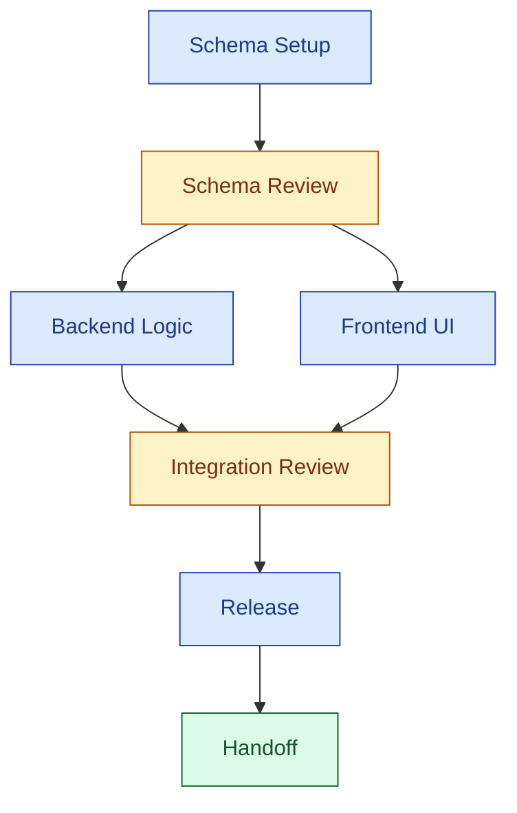

# Write Executable Plan Reference

This file defines the plan contract used by `write-executable-plan`.

## Notation

Entry-level glossary for the building blocks introduced in `SKILL.md`'s
`The Plan Skeleton`. One-liner definitions here; full semantics in the linked
sections.


| Term               | One-liner                                                                                                                                                       | Full detail                                             |
| ------------------ | --------------------------------------------------------------------------------------------------------------------------------------------------------------- | ------------------------------------------------------- |
| `core contract`    | The fixed skeleton of headings every plan MUST contain.                                                                                                         | [Core Contract](#core-contract)                         |
| `Task Type`        | A free-form kebab-case slug describing the work (e.g. `search-suggestions-cache`, `payment-read-migration`, `reporting-service-split`). Drives filename and debug log naming. | [Plan File Naming](#plan-file-naming)                   |
| `contract profile` | One of `delivery` / `refactor` / `migration` / `exploration`; selects the conditional sections to include.                                                      | [Contract Profiles](#contract-profiles)                 |
| `Mode`             | `credit-rich` (default) or `budget-limited`; controls verbosity, clarifying questions, and debug-loop budgets.                                                  | [Execution Modes](#execution-modes)                     |
| `Decision Points`  | Triggers for the executor's debug loop, not terminal stops.                                                                                                     | [Decision Points semantics](#decision-points-semantics) |
| `DAG node`         | A unit that takes a claim and produces an outcome — shape is determined by id prefix: stage `s*`, checkpoint `ck*`, or handoff `h`.                             | [Node Content Templates](#node-content-templates)       |
| `Checkpoints`      | Two kinds — implicit **stage autopilot** and explicit **checkpoint nodes** (`ck*`) in the dependency graph.                                                     | [Checkpoints](#checkpoints)                             |
| `Stage Claims`     | Runtime coordination ledger — three-state markers (`[ ]`/`[~]`/`[x]`) one per DAG node, so executors can claim, progress, and complete nodes without collision. | [Stage Claims](#stage-claims)                           |
| `Handoff`          | Mandatory terminal handoff node (single DAG sink) — final verification and sign-off; its checklist is plan-specific.                                            | [Handoff shape](#handoff-shape-h)                       |


---

**Part I — Orient**

---

## Core Contract

Every generated plan must include the following top-level structure: 5 metadata lines (`Goal`, `Task Type`, `Contract Profile`, `Mode`, `Primary Success Signal`) followed by 10 required `##`  headings — `Inputs / Context Sources`, `Context Scope`, `Output`, `Dependency Graph`, `Stages`, `Verification`, `Decision Points`, `Decision Log`, `Debug Log Standard`, `Stage Claims`. Contract profile may add conditional headings.

**Template:** start from `[plan_template.md](plan_template.md)` and fill in every placeholder — it is the canonical copyable shape. Semantics for each heading live in the sections that follow.

Two boilerplate blocks inside the template — `## Debug Log Standard` and `## Stage Claims` — ship with default blockquote wording the composer can drop in as-is. Rewording is allowed when it aids clarity, as long as the intent is preserved:

- `## Debug Log Standard` still points the executor at the debug log format and at the filename convention `debug.<contract-profile>.<task-type>.<MMDDHHMM>.md`. See [Debug Log Format](#debug-log-format) for format details.
- `## Stage Claims` still describes the three-state ledger protocol. See [Stage Claims](#stage-claims) for the claim protocol. The validator only checks the ledger entries (`- [ ] <id>: <label>`); the blockquote wording itself is not enforced.

The core contract defines the minimum safe structure. It does **not** require every plan to prescribe identical implementation behavior.

Schema rule:

- `Task Type` is an open-ended label that describes the actual nature of the work.
- `Contract Profile` is the controlled enum that determines which contract shape to apply.

## Plan File Naming

Every plan file's basename must match:

```
plan.<contract-profile>.<task-type>.md
```

- `<contract-profile>` is one contiguous run of lowercase ASCII letters (`a-z`), no digits and no hyphens. In practice it is always one of the four allowed values `delivery`, `refactor`, `migration`, `exploration`; the validator also enforces that enum after the regex match (see `ALLOWED_CONTRACT_PROFILES` in `scripts/validate-plan.py`).
- `<task-type>` is a lowercase kebab-case slug (allowed characters: `a-z`, `0-9`, `-`). Hyphens let the task type carry multi-word names such as `search-suggestions-cache`; the preceding `<contract-profile>` segment deliberately forbids hyphens so the dot-separated structure of the filename stays unambiguous.
- The prefix `plan.` and suffix `.md` are fixed.
- Exactly three dot-separated segments between `plan` and `md` are allowed (i.e. the basename has exactly three literal `.` characters: one after `plan`, one between `<contract-profile>` and `<task-type>`, one before `md`). Extra dots are rejected.

Validator regex:

```
^plan\.[a-z]+\.[a-z0-9-]+\.md$
```

Examples:

```
plan.delivery.search-suggestions-cache.md
plan.migration.payment-read-migration.md
plan.refactor.reporting-service-split.md
plan.exploration.vector-search-feasibility-experiment.md
```

Rules:

- The filename constraint applies in both `credit-rich` and `budget-limited` modes. Filename cost is effectively zero, so there is no reason to relax it under budget pressure.
- The validator checks **basename only**. Directory placement is intentionally out of scope and can be decided per project.
- The validator does **not** cross-check the filename against the plan's `Contract Profile` and `Task Type` metadata. Keeping the filename in sync with the plan content is the author's responsibility.
- If the plan's `Contract Profile` or `Task Type` changes materially, rename the file in the same change and record the rename in the `Decision Log`.

## Contract Profiles

Every plan picks one primary contract profile. The profile drives which conditional sections the [Required vs Conditional Sections matrix](#required-vs-conditional-sections) requires downstream.


| Profile       | Use when                                                                         | Required emphasis                                                                                                | Additional sections                                                                            |
| ------------- | -------------------------------------------------------------------------------- | ---------------------------------------------------------------------------------------------------------------- | ---------------------------------------------------------------------------------------------- |
| `delivery`    | the goal is a user-visible capability or new workflow                            | user-visible outcome · acceptance walkthrough · file ownership · happy-path verification                         | **Recommended:** `Risks & Mitigations`; `Sources / Rationale` (when the design is not obvious) |
| `refactor`    | the goal is structural improvement while preserving behavior                     | invariants to preserve · compatibility expectations · rollback-friendly sequencing · behavior-preservation proof | **Recommended:** `Non-Goals`; `Compatibility / Migration` (if the refactor affects interfaces) |
| `migration`   | the work changes data shape, rollout path, operational behavior, or back-compat  | rollout path · rollback path · compatibility boundary · observability / verification during rollout              | **Required:** `Rollout / Rollback`; `Compatibility / Migration`; `Risks & Mitigations`         |
| `exploration` | uncertainty is high and the immediate goal is to validate feasibility or de-risk | hypothesis · prototype boundary · success / discard criteria · promotion path into implementation work           | **Recommended:** `Sources / Rationale`; `Checkpoint Notes`                                     |


## Execution Modes


| Mode                    | Use when                                                                                                                           | Behavior                                                                                                                                                          |
| ----------------------- | ---------------------------------------------------------------------------------------------------------------------------------- | ----------------------------------------------------------------------------------------------------------------------------------------------------------------- |
| `credit-rich` (default) | the user does not express cost sensitivity · the work is ambiguous or complex · extra checkpoints would meaningfully reduce rework | fuller context assembly · richer rationale where useful · more willingness to add checkpoint jobs · more complete optional sections when risk justifies them      |
| `budget-limited`        | the user explicitly asks for a leaner path · the task is straightforward enough to justify compression                             | fewer questions · fewer checkpoints · minimal viable context assembly · keep only the smallest sufficient contract · include optional sections only for real risk |


---

**Part II — Author**

---

## Required vs Conditional Sections

Use this table when deciding what belongs in the generated plan.

> **Mechanically enforced** by `scripts/validate-plan.py`: required metadata fields, required sections in this table, Dependency Graph topology with `h` as single sink, id alignment across `## Dependency Graph` ↔ `## Stages` ↔ `## Stage Claims`, per-shape content block fields dispatched by id prefix, Stage Claims ledger shape, plan filename, and contract-profile-specific extras below. Composer is responsible for the *content* inside each section; the validator only checks the *shape*.


| Section                     | Rule        |
| --------------------------- | ----------- |
| `Goal`                      | Required    |
| `Task Type`                 | Required    |
| `Contract Profile`          | Required    |
| `Mode`                      | Required    |
| `Primary Success Signal`    | Required    |
| `Inputs / Context Sources`  | Required    |
| `Context Scope`             | Required    |
| `Output`                    | Required    |
| `Dependency Graph`          | Required    |
| `Stages`                    | Required    |
| `Verification`              | Required    |
| `Decision Points`           | Required    |
| `Decision Log`              | Required    |
| `Debug Log Standard`        | Required    |
| `Stage Claims`              | Required    |
| `Proposed Deliverables`     | Conditional |
| `Committed Deliverables`    | Conditional |
| `Non-Goals`                 | Conditional |
| `Risks & Mitigations`       | Conditional |
| `Rollout / Rollback`        | Conditional |
| `Compatibility / Migration` | Conditional |
| `Metrics / KPI`             | Conditional |
| `Checkpoint Notes`          | Conditional |
| `Sources / Rationale`       | Conditional |


Rules:

- `Conditional` means the section is required only when the contract profile, risk profile, or user request demands it.
- When in doubt, prefer the smallest contract that still keeps execution safe.

## Context Sources and References

A plan's grounding and references involve three distinct concepts:

- **Generation-time context sources** — what the composer reads to author the plan.
- **Context Scope** — what local materials the executor is allowed to rely on.
- **Plan-time rationale references** — what is written into the plan itself to explain decisions.

Each is covered below.

### Generation-time context sources

These are the inputs used to create the plan:

- attached file paths
- user-provided context
- repo files and symbols
- spec or design docs
- wiki content
- previous plans or notes

Priority:

1. user-provided paths and explicit context
2. repo-local grounding
3. optional external or wiki-based context

If the user already attached the relevant area, that is sufficient grounding. Do not force an additional research workflow unless there is a real gap.

### Context Scope

`Context Scope` records which local materials the plan is allowed to rely on.

Use it to:

- list allowlisted local files or directories
- record whether any supplementary context bundle was prepared
- prevent downstream agents from assuming unrestricted repository access

If a sub-agent is used during planning, pass only the allowlisted context needed for that task rather than broad repository access.

### Plan-time rationale references

These are references written into the plan itself to explain decisions.

Use them when:

- architecture choices are contested
- rollout or migration risk is high
- research materially changed the recommended path
- the contract profile is `exploration`

Do not force rationale references into every simple plan.

## Dependency Graph and Checkpoints

The plan separates two concerns: structural organization (what depends on what) and review gates (where to pause-and-verify).

### Dependency Graph

The plan arranges its nodes into a directed graph.

- **Nodes** are DAG nodes identified by short ids. Each id carries a **type prefix** (see "Node id convention" below); the prefix is the only type hint embedded in the DAG.
- **Edges** point **from upstream to downstream**: `A --> B` reads as *"B depends on A's output"*. The arrow follows data/dependency flow, not a "this happens, then that happens" timeline. The validator uses the same convention to identify the sink.
- **No edge** between two nodes means they are structurally independent (parallelizable).

The composer **declares structure only** — who depends on who. The **executor decides the execution pattern** at runtime: serial, fork-join parallel, sub-agent dispatch, best-of-N, or split across multiple executors. The plan must hold under any of these.

The Dependency Graph holds topology only — node labels in the graph are display-only abbreviations (keep them short so wide graphs still render). Actual content for each node lives in the corresponding content block under `## Stages` (shape dispatched by id prefix — see [Node Content Templates](#node-content-templates)).

**Node id convention** (enforced by validator):


| Prefix | Role       | Content block shape                                              |
| ------ | ---------- | ---------------------------------------------------------------- |
| `s*`   | stage      | [stage-shape](#stage-shape-s)                                    |
| `ck*`  | checkpoint | [checkpoint-shape](#checkpoint-shape-ck)                         |
| `h`    | handoff    | [handoff-shape](#handoff-shape-h) — singleton, no numeric suffix |


The id is the authoritative key; DAG node ids, `## Stages` content block ids, and `## Stage Claims` entry ids form identical sets. Labels are free-form display text and can differ between DAG and content block (the validator does not compare labels).

**Topology requirements** (enforced by validator):

- The graph is acyclic.
- Exactly one sink node, whose id is `h`.
- Every other node has a path to `h`.

**Surface forms** the validator accepts:

- A `mermaid` flowchart with `id[label]` declarations and `-->` / `->` edges (chains like `a --> b --> c` are split into individual edges). Mermaid edge labels — both pipe form (`a -->|text| b`) and inline form (`a -- text --> b`) — are tolerated and stripped before parsing, so no phantom `text` node is emitted.
- Plain arrow prose using `->` or `-->`, one expression per line. Chains are allowed.

**Fence-priority rule:** if the Dependency Graph section contains *any* fenced block whose info string starts with `mermaid` (e.g. ` ```mermaid `, ` ```mermaid flowchart-elk `), the validator treats the mermaid body as the single source of truth and ignores plain-arrow prose *outside every fence* in that section. Fenced blocks with a non-`mermaid` info string (e.g. ` ```text `, ` ```bash `) do NOT trigger this suppression — their bodies are skipped like any code block, but plain-arrow prose outside the fence remains legal. A section with no mermaid fence at all falls back to plain-arrow prose everywhere. This keeps the mermaid diagram authoritative when present without penalising illustrative `text` / shell fences living alongside a prose DAG.

Example (with color coding):




**Color coding** (recommended, not enforced):

Mermaid `classDef` lets composers tint nodes by type for readability. The palette above (blue stages / amber checkpoints / green handoff) is the default suggestion. Group ids in a single `class` line per type so the mapping stays aligned with the id-prefix convention.

Rendering:

- Prefer Mermaid flowcharts; structured prose is acceptable when the graph is small.
- DAG labels should be short. Put the full, human-readable stage/checkpoint name in the content block header under `## Stages`.

### Checkpoints

Checkpoints come in two kinds.

- **Stage autopilot** — implicit per-stage verification (tests pass, outputs exist, lints clean). Always present. Not declared in the plan. Belongs to the executor's internal stage-completion logic.
- **Explicit checkpoint node** (`ck*`) — a dedicated review node declared in the Dependency Graph and given a content block under `## Stages` using the [checkpoint-shape](#checkpoint-shape-ck) template. Review-only; no implementation work happens inside a checkpoint node.

Everything below refers to **explicit checkpoint nodes** unless noted.

Modes (value of the `**Mode:`** field inside the checkpoint content block):

- `auto_review` (default) — the executor reviews automatically.
- `human_review` — use only when the user explicitly wants involvement or a high-risk ambiguity remains unresolved.
- `hybrid` — auto review first; escalate to human only on failure.

When to insert a `ck*` node:

Use this list when deciding whether proceeding wrong costs more than stage autopilot can catch.

Structural triggers (examine the dependency graph):

- Where independent branches **merge** (join) — the merge is the first place a problem in any branch becomes visible.
- **Immediately upstream of an irreversible node** (data migration, public API release, destructive deploy).
- At a **fork** where the upstream stage's output chooses which downstream branch to take.

Semantic triggers (examine the task):

- The work crosses a major architecture boundary.
- The next stage would be expensive to redo.
- Unresolved design ambiguity with meaningful downstream impact.
- The user explicitly wants intermediate review.
- **Scope discipline / work containment** — the work is exploratory or investigative and the primary failure mode is silent expansion into production-grade implementation that outruns the original decision. A `ck*` here gates the deliverable: is the output still answering the question the plan was set up to answer, or has the scope drifted? Main failure mode for `exploration`-profile plans; may also apply to `delivery` plans with uncertain boundaries.

By default, prefer automatic review over asking the human.

Placement:

- Declare the checkpoint as a `ck*` node in `## Dependency Graph`, wire its edges.
- Define the content block under `## Stages` with header `### ck<N>: <label>`, using [checkpoint-shape](#checkpoint-shape-ck) fields.
- Seed a matching ledger entry in `[## Stage Claims](#stage-claims)`.

### Stage Claims

The `## Stage Claims` section is the plan's runtime coordination ledger. It tracks claim state over every DAG node (stages `s*`, checkpoints `ck*`, handoff `h`) so one or multiple executors can work on the same plan without collision.

Entry format: `- [ ] <id>: <label>`. The `<id>` is the authoritative key — it must match a DAG node id one-to-one. The `<label>` is display-only and may be abbreviated.

Marker set (three-state):


| Marker                                          | Meaning                 |
| ----------------------------------------------- | ----------------------- |
| `- [ ] <id>: <label>`                           | unclaimed               |
| `- [~] <id>: <label> — <agent-id> @ <MMDDHHMM>` | claimed and in progress |
| `- [x] <id>: <label> — <agent-id> @ <MMDDHHMM>` | done                    |


Composer seeds one entry per DAG node in readable topological order. The `h` handoff entry is always last.

Claim protocol:

1. An executor scans `## Stage Claims` together with `## Dependency Graph`.
2. A node is **claimable** when all three hold:
  - its marker is `- [ ]`,
  - every upstream DAG node is `- [x]`,
  - no other executor has left `- [~]` on it.
3. The executor flips `- [ ]` → `- [~] ... — <agent-id> @ <MMDDHHMM>` and starts work.
4. On completion, the executor flips `- [~]` → `- [x] ... — <agent-id> @ <MMDDHHMM>`.
5. When every earlier entry is `- [x]`, the `h` node becomes claimable. Marking `h` as `- [x]` concludes the plan.

Checkpoints (`ck*`) in the ledger:

- Checkpoint nodes participate like any other node.
- `auto_review` — the executor passing through does the review and flips `- [ ]` → `- [~]` → `- [x]` within one pass.
- `human_review` — the executor flips to `- [~]` when escalating; the human's completion of review flips to `- [x]`.
- `hybrid` — same as `auto_review` on success; falls back to `human_review` on failure.

Conflict and reclaim:

- If two executors target the same `- [ ]` simultaneously, the one who commits the `- [~]` edit first wins; the other, on re-reading before editing, sees the `- [~]` and picks another claimable node.
- If an executor abandons a `- [~]` without completing (process killed, timeout, escalated to user with no continuation), a later executor may flip it back to `- [ ]` and record the reclaim in `## Decision Log`.

## Node Content Templates

Every DAG node declared in `## Dependency Graph` has one content block under `## Stages`. The **shape** of that block is dispatched by the node's id prefix:

- `s*` (e.g. `s1`, `s2`) → **stage-shape** (work unit)
- `ck*` (e.g. `ck1`, `ck2`) → **checkpoint-shape** (review gate)
- `h` (singleton) → **handoff-shape** (terminal sign-off)

These three prefixes are the canonical set; a header with an unknown id prefix (e.g. `### xy1: ...`) is rejected by the validator. Extending the set requires adding a new shape template to this section first.

Separation of concerns: the DAG layer declares *who depends on who*; content blocks describe *what each node actually does*. The DAG itself does not know that a node is a checkpoint — it only sees ids and edges. Shape is a content-layer property driven by the id prefix.

Content block header format: `### <id>: <label>`. The `<label>` is free-form human-readable text; it may be abbreviated or expanded relative to the DAG's own label (DAG labels tend to be short for rendering). The id is the authoritative key that binds DAG node ↔ content block ↔ `## Stage Claims` entry.

### Common fields

All shapes share these fields:


| Field         | Rule        | Applies to |
| ------------- | ----------- | ---------- |
| `Purpose`     | Required    | all shapes |
| `Checklist`   | Required    | all shapes |
| `Exit Signal` | Recommended | all shapes |


Rules:

- Every field except `Checklist` is written as `**<Field>:** <value>` on a single line. The value must start on the same line as the label — a bare `**Field:**` with no content (or trailing whitespace only) is rejected by the validator as "missing required field".
- **`Checklist` is the one exception to the single-line rule.** It is written as a standalone label line (`**Checklist:**` followed by nothing) with `- [ ]` bullet items on the subsequent lines. An inline form (`**Checklist:** some text`, with or without whitespace between the label and the value) is rejected; the label must own its own line so executors can unambiguously locate the bullets.
- `Purpose` is a one-sentence statement of what the node is responsible for.
- `Checklist` bullets define the work (stage / handoff) or the pass criteria (checkpoint).
- `Exit Signal` is an observable signal that the node is complete; strongly recommended when the transition to downstream nodes would otherwise be ambiguous.
- In `budget-limited` mode, recommended fields may be omitted if the node remains clearly executable without them.

### Stage shape (`s*`)

```markdown
### s1: <Stage Name>

**Purpose:** <what this stage is responsible for>
**Files:** `<repo-relative path>`, `<repo-relative path>`
**Exit Signal:** <what tells the next agent this stage is ready to transition>
**Checklist:**
- [ ] <job A>
- [ ] <job B>
```

Shape-specific fields:


| Field   | Rule        |
| ------- | ----------- |
| `Files` | Recommended |


Rules:

- `Files` is recommended when the stage touches concrete repo areas; prefer exact repo-relative paths.
- Use purpose + checklist + exit signal to preserve implementation creativity without losing execution clarity.
- Avoid turning the stage into a shell script unless that is truly the right artifact.

### Checkpoint shape (`ck*`)

```markdown
### ck1: <Checkpoint Name>

**Purpose:** <review scope — what this gate is verifying>
**Mode:** auto_review
**Exit Signal:** <pass verdict — typically "all pass criteria green">
**Checklist:**
- [ ] <pass criterion A>
- [ ] <pass criterion B>
**On Fail:** <action — revise_plan | stop | escalate>
```

Shape-specific fields:


| Field     | Rule        |
| --------- | ----------- |
| `Mode`    | Required    |
| `On Fail` | Recommended |


Rules:

- `Mode` is one of `auto_review` / `human_review` / `hybrid`; see [Checkpoints](#checkpoints) for semantics.
- `Checklist` items for a checkpoint are **pass criteria**, not work items. The executor marks each `[ ]` to `[x]` as it verifies the criterion.
- `On Fail` documents what to do when criteria do not pass; if omitted, executor defaults to escalate.
- No implementation work happens inside a checkpoint node — it is review-only.

### Handoff shape (`h`)

```markdown
### h: Handoff

**Purpose:** <one sentence — what sign-off this handoff confirms for this plan>
**Exit Signal:** Every earlier `## Stage Claims` entry is `[x]` and the Primary Success Signal holds.
**Checklist:**
- [ ] All prior `## Stage Claims` entries are `[x]`
- [ ] Primary Success Signal holds
- [ ] <plan-specific wrap-up item>
```

Rules:

- The `h` node is the **single DAG sink** — every other node must reach it through some path.
- `Handoff` Checklist carries concrete plan-specific sign-off items; it is not a generic boilerplate copy.
- Marking `h` as `[x]` in `## Stage Claims` concludes the plan.
- There is exactly one `h` per plan; the id `h` is singleton (no numeric suffix).

## Decision Log Format

Use short, explicit entries:

```markdown
## Decision Log

- Decision: Inserted a checkpoint before migration execution
  Why: Rollback risk was higher than expected after reading the storage layer

- Decision: Kept `Task Type` as `payment-read-migration` but changed `Contract Profile` from `delivery` to `migration`
  Why: The work requires compatibility handling and staged rollout
```

Keep the log concise. Record why the plan changed, not every trivial edit.

---

**Part III — Validate & Hand Off**

---

## Validation

Always validate (blocking issues):

- required sections exist
- no **hard placeholders** remain (lazy list items such as `- implement later`, `- write tests`, `- add tests`, `- handle edge cases`, `- fill in later`)
- every content block has the required fields for its shape
- Dependency Graph is acyclic, has `h` as its single sink, and every node reaches `h`
- DAG node ids align one-to-one with content block ids and Stage Claims entry ids
- filename matches `plan.<contract-profile>.<task-type>.md` (see [Plan File Naming](#plan-file-naming))

Debug logs (see [Execution Policy](#execution-policy-debug-loop) and [Debug Log Format](#debug-log-format)) are NOT validated by the shipped validator. They are execution-time artifacts and their compliance is enforced by the MUST language in this reference plus human review during escalation.

Soft-validate (non-blocking warnings):

- `TODO` / `TBD` markers present in non-code content — these signal known information gaps the author could not resolve at plan-writing time; a downstream agent must confirm them with the user before final execution rather than treat them as acceptable final state

Conditionally validate with metrics or KPI when:

- the work is a migration
- the plan spans multiple major stages
- the user asks for strict evaluation
- performance, reliability, or rollout behavior is a core concern

Possible metrics:

- execution success rate
- checkpoint pass / fail rate
- clarification count
- task reordering frequency
- placeholder detection count

## Validator Script

Running the validator is **mandatory**. Step 10 of the composer workflow requires every plan to pass `scripts/validate-plan.py` before handoff; unresolved errors MUST be fixed (warnings MAY ship if they represent user-facing clarifications the composer intentionally left in, but the next agent must see them).

```bash
python3 scripts/validate-plan.py path/to/plan.md
```

Run it from the skill directory when using the relative form above.

Scope of what the validator covers vs. what it does not:

- **Covered (shape / structure):** required metadata fields, required headings, Dependency Graph topology (acyclic, `h`-only sink, reachability), id alignment across DAG ↔ `## Stages` ↔ `## Stage Claims`, per-shape content block fields, Stage Claims ledger shape, plan filename, contract-profile-specific extras. See the [Required vs Conditional Sections matrix](#required-vs-conditional-sections) for the full list.
- **Not covered (content / semantics):** architecture soundness, task decomposition quality, whether the chosen contract profile matches the work, ambiguity in natural-language fields. The [Self-Review Checklist](SKILL.md#self-review-checklist) covers these; human judgment still matters.

In other words: validator green is **necessary but not sufficient**. Treat it as a quality gate, not as a proof of plan quality.

---

**Part IV — Runtime & Reference**

---

## Plan Mutation Policy

Plans are living documents.

When the plan changes materially:

- update the relevant task or stage
- record the change in `Decision Log`
- preserve enough context for a downstream agent to restart safely

Material changes include:

- changed architecture direction
- inserted or removed checkpoint
- altered task ordering
- changed risk assumptions
- narrowed or widened scope

## Deliverable Freeze Policy

Plans declare what they produce at two granularities:

- `Output` (required) — sketch-level "what" the plan produces, one or two lines.
- `Proposed Deliverables` / `Committed Deliverables` (conditional) — detailed artifact tree when file shape is firm enough to matter.

This section describes only the conditional layer. `Output` is always present; see [Core Contract](#core-contract).

Plans may distinguish between:

- `Proposed Deliverables`
- `Committed Deliverables`

Use `Proposed Deliverables` when:

- the artifact tree is still provisional
- the exact file split depends on later discovery
- the work is in an exploratory or architecture-shaping phase

Use `Committed Deliverables` when:

- the artifact shape is stable enough for downstream execution
- the next agent should treat the listed outputs as the expected delivery target

Rules:

- `Proposed Deliverables` is conditional.
- `Committed Deliverables` is conditional but strongly recommended once artifact shape is stable.
- If both sections appear, `Committed Deliverables` should be the narrower, more final list.

## Execution Policy: Debug Loop

> **Scope (execution-time rule set):** This section describes what happens when an executor runs your plan. As the writer, you reference it to choose `Mode`, set checkpoint modes, and write correct `Decision Points` and `Verification`. You do NOT perform the debug loop during plan writing.

Plans produced by this skill are executed under a resilient-by-default contract. Downstream agents do NOT treat the first obstacle as a cue to ask the user. They run a bounded debug-and-fallback loop first.

### Flow

1. **Debug attempts** — when execution is blocked (implementation fails, tests fail, a `Decision Point` fires, or any other technical obstacle), try up to three distinct approaches; each attempt must be a reversible patch and must be logged as a new `## Session N` entry in the debug log.
2. **Stage reprioritization** — if all three attempts fail, switch to an unblocked stage. The agent judges stage independence from the current blocker.
3. **Analysis report** — when all stages are blocked, record root cause, per-stage blocker mapping, and candidate new directions inside the debug log.
4. **Self-review** — review the analysis report in the same debug log; if a new approach emerges, re-enter the loop at step 1.
5. **Ask user** — escalate only after all of the above have been exhausted.

### Budget

For plans executed under this contract:


| Budget                  | Value         | Notes                                            |
| ----------------------- | ------------- | ------------------------------------------------ |
| Same-action retries     | 3             | Overrides the global default of 2                |
| Same-hypothesis retries | 3             | Overrides the global default of 2                |
| Tool turns per stage    | 15            | Each stage carries its own 15-turn budget        |
| Tool turns per task     | `stages × 15` | Total task-level budget derived from stage count |


Exhausting the per-stage turn budget counts as an unsuccessful self-review and triggers escalation.

**Under `budget-limited`, the loop compresses:**

- Try 1 approach per blocker (not 3).
- Skip the Analysis Report and Self-Review steps if no stage can be reprioritized. Escalate directly.

### `Decision Points` semantics

When a `Decision Point` fires, the executor pauses the current direction — the intended analogy is a traffic-intersection stop — evaluates the blocker against the debug-loop policy (see [Flow](#flow)), and picks the next move: retry with a new hypothesis, switch to an unblocked stage, or escalate. It is NOT a terminal stop, and it does NOT require immediately asking the user.

Hard-stop exceptions — the only events that bypass the decision flow above:

- The user explicitly requests a stop.
- The full debug loop has been exhausted.

This framing is intentional: in practice most plans run against a codebase where the relevant code is already available, so a blocker usually signals a fixable gap. Treating every `Decision Point` as a terminal event loses value that bounded debug attempts could recover.

### Session discipline

Each debug session must satisfy two rules.

**Patch discipline** — every debug attempt MUST be reversible:

- A unified-diff patch block recorded in the debug log.
- A recovery instruction recorded alongside the patch.
- Irreversible changes are forbidden inside the loop. If irreversibility is unavoidable, escalate BEFORE performing the change.

**Hypothesis uniqueness** — across sessions in the same debug log, each `**Hypothesis:`** MUST be materially different. "Different" means rooted in a distinct root-cause hypothesis, not a superficial parameter tweak. The `**Diff from previous:`** field on Session 2+ exists to make this difference explicit. Compliance is the author's and agent's responsibility; the validator does not enforce it.

### Common Execution-Time Mistakes

The debug-loop contract is designed to prevent the following executor-visible failures. They are listed here so writers can recognize them when reviewing debug logs, and so writers understand what weak choices of `Mode`, `Checkpoint` modes, or `Decision Points` tend to enable downstream.

- **Stopping at the first obstacle.** The executor asks the user immediately instead of running the bounded debug loop. Violates the [debug-loop flow](#flow) and [Decision Points semantics](#decision-points-semantics).
- **Irreversible debug attempts.** The executor produces a patch without a matching `### Recovery` entry, or makes an irreversible change inside the loop. Violates [session discipline](#session-discipline).

## Debug Log Format

> **Scope:** This section describes the shape of an artifact the executor produces during execution. You do not author debug logs; you reference this format so you understand what your plan's `Decision Points` will cause downstream.
>
> **Template:** executors start from `[debug_log_template.md](debug_log_template.md)` at the moment the debug loop is entered. This section defines the rules that template conforms to.

### Filename

Debug log basename:

```
debug.<contract-profile>.<task-type>.<MMDDHHMM>.md
```

- `<contract-profile>` and `<task-type>` mirror the plan's values.
- `<MMDDHHMM>` is the local start time of the debug session: two-digit month, day, hour, and minute, zero-padded (example: `04171630` = April 17, 16:30).
- Multiple debug logs for the same plan are distinguished by their timestamps.
- Since this is an execution-time artifact, the shipped validator does not check this filename. Authors and agents are responsible for consistent naming.

### Document structure

See `[debug_log_template.md](debug_log_template.md)` for the full copyable skeleton. A valid debug log starts with a header block (plan pointer, start time, context one-liner) followed by one or more `## Session N` blocks, each containing:

- metadata lines (`**Blocker:**`, `**Hypothesis:**`, `**Approach:**`, `**Diff from previous:**`)
- `### Patch` with a unified diff
- `### Recovery` with undo instructions
- `### Result` with outcome

Session numbering: `Session 1` is the first attempt; `Session 2+` each introduce a new hypothesis. `**Diff from previous:**` is required for Session 2+; it explains materially how this session differs from the previous attempt.

### Optional sections

After the `## Session N` blocks (sessions come first, in chronological order), the following sections may appear, in this order, each referencing blocked/unblocked nodes by their DAG id (`s*` / `ck*` / `h`). See `[debug_log_template.md](debug_log_template.md)` for the concrete shapes:

1. `## Stage Reprioritization` — executor swaps to an independent node when the current one is blocked.
2. `## Analysis Report` — consolidated view across failed sessions plus per-node blocker mapping and candidate new directions.
3. `## Self-Review` — decision on whether to continue with a new approach or escalate.

### Enforcement

This skill intentionally does not ship a validator for debug logs. Debug logs are execution-time artifacts, not plan deliverables. Compliance with the [Debug Log Format](#debug-log-format) is enforced via:

- The MUST language in [SKILL.md](SKILL.md) and this reference.
- Human review when a debug log reaches escalation.
- Agent self-discipline when following the execution policy.

## Executor Compatibility

Plans should be shaped so a downstream executor can consume them without major structural transformation.

Rules:

- Do not bind the plan to a single host-specific execution workflow.
- Keep verification, decision points, and the `Handoff` stage explicit enough for different executors to follow.
- Prefer structural compatibility over tool-specific instructions when both are possible.

## Example Fallback Policy

Examples are helpful but expensive to perfect.

Examples are illustrative references, not universal best practices for every case.

Use them to understand:

- what makes a plan executable in general
- which contract qualities should transfer across cases
- which details are local to the example and must be adapted

Positive examples should explain **why** they are strong in abstract, general terms.

Negative examples should explain:

- what class of contract failure they represent
- why that failure would hurt downstream execution
- what kinds of changes would repair the plan

Use this fallback ladder:

1. Full matching example for the same contract profile
2. Closest contract-profile example
3. Partial snippet for the relevant section
4. Anti-pattern plus correction
5. Core checklist only

Never block plan generation solely because a perfect example is unavailable.

## Cross-Regime Term Disambiguation

A few terms appear in both the plan-writing and plan-execution rule sets with different meanings. Keep the two faces straight when writing plans.


| Term                                      | While writing (your action / decision)                                                                               | At execution (executor behavior)                                                                                               |
| ----------------------------------------- | -------------------------------------------------------------------------------------------------------------------- | ------------------------------------------------------------------------------------------------------------------------------ |
| `Decision Points`                         | Write one concrete bullet per trigger condition that should prompt the executor to pause and re-evaluate             | Executor treats each bullet as entry to the debug loop (retry / reprioritize / escalate), NOT as an immediate ask-user signal  |
| `Mode: credit-rich`                       | You may ask more clarifying questions; allow more checkpoints                                                        | Executor allows up to 3 retries; runs full Analysis Report + Self-Review before escalating                                     |
| `Mode: budget-limited`                    | Prefer defaults over questions; keep contract minimal                                                                | Executor tries 1 retry per blocker; skips Analysis Report + Self-Review when no stage can be reprioritized                     |
| `Explicit checkpoint: auto_review`        | Default; insert a `ck*` node where review adds value (see [Checkpoints](#checkpoints) triggers); `Mode: auto_review` | Executor reviews automatically; does NOT pause for human                                                                       |
| `Explicit checkpoint: human_review`       | Use only when user explicitly wants involvement or high-risk ambiguity remains unresolved; `Mode: human_review`      | Executor pauses execution and waits for human                                                                                  |
| `Explicit checkpoint: hybrid`             | Use when you want auto first with human as fallback; `Mode: hybrid`                                                  | Executor runs auto review; escalates to human on failure                                                                       |
| `Handoff` node (`h`)                      | Declare the `h` node as single DAG sink; give it handoff-shape content with plan-specific Checklist                  | Executor treats as any other node (claim → work → mark `[x]`); marking `h` `[x]` concludes the plan                            |
| `Stage Claims` entries                    | Seed one `- [ ] <id>: <label>` per DAG node in readable topological order; never pre-fill `[~]`/`[x]`                | Executor flips `[ ]` → `[~]` at claim, `[~]` → `[x]` at completion; a `[~]` blocks other executors from claiming the same node |
| `TODO` / `TBD` in plan text               | Soft placeholder for a gap you could not resolve during drafting                                                     | Validator emits non-blocking warning; a downstream agent surfaces it to the user for clarification before final execution      |
| Per-stage 15 tool turns                   | *(Not yours — do not apply this budget to your own context-gathering)*                                               | Executor budget per stage; exhaustion counts as unsuccessful self-review and triggers escalation                               |
| 3 × same-action / same-hypothesis retries | *(Not yours — plan writing has no retry concept)*                                                                    | Executor's debug-loop retry limit within the same hypothesis or action                                                         |


Use this table as a lookup whenever you are about to write one of these terms into a plan and want to double-check the downstream effect.